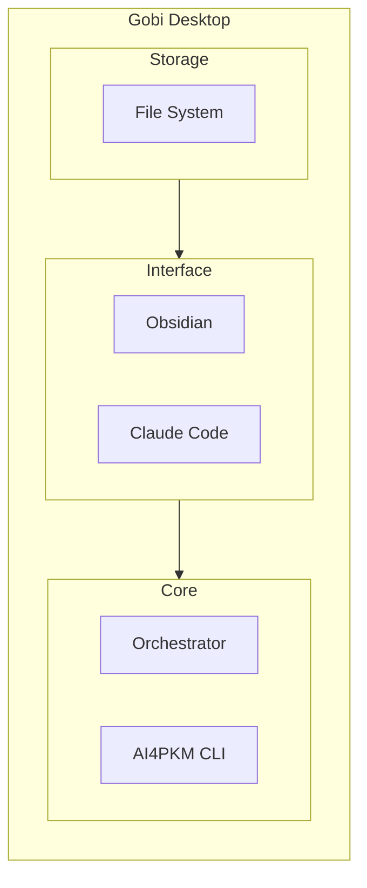

# AI4PKM Helper

This skill provides guidance for configuring and managing AI4PKM orchestrator and workers. It helps users set up agents, configure multi-worker execution, and manage CLI workflows.

## AI4PKM Architecture



**3-tier model:**
- **Storage**: Markdown files (AI-optimal format)
- **Interface**: Obsidian for viewing/editing, Claude Code for AI interaction
- **Core**: Orchestrator for automation, CLI for quick commands
- **GUI**: Gobi Desktop wraps all above with visual interface

## When to Use This Skill

Claude should automatically load this skill when:
- User wants to add, modify, or remove agents/nodes in orchestrator.yaml
- User wants to configure multi-worker execution (comparing AI models)
- User wants to update orchestrator defaults (executor, timeout, max_parallel)
- User wants to add or modify pollers (limitless, apple_photos, apple_notes)
- User asks about CLI commands for orchestrator management
- User needs help with orchestrator.yaml structure

## Quick Commands

```markdown
"워커 설정" / "Worker config" → Worker Configuration Guide
"에이전트 추가" / "Add agent" → Add New Agent Node
"폴러 설정" / "Poller config" → Poller Configuration
"설정 보기" → Show Current Config (ai4pkm --show-config)
"에이전트 목록" → List Agents (ai4pkm --list-agents)
"Orchestrator 설정" → Orchestrator Setup Module
"태스크 추가" → Task Management Module
```

## Core Modules

### Module 1: Orchestrator Setup (워크플로우 자동화)

**Purpose**: Configure orchestrator.yaml for event-driven automation

**Key Concepts**:
- **Node**: Event-driven agent that triggers on file changes or schedules
- **Executor**: AI engine to run (claude_code, codex_cli, gemini_cli)
- **Poller**: External data sync (limitless, apple_photos, apple_notes)
- **Worker**: Execution unit within a node (supports multi-worker for model comparison)

**Setup Process**:
1. Explain orchestrator purpose and benefits
2. Show orchestrator.yaml structure (nodes, pollers, defaults)
3. Configure first agent (e.g., EIC - Enrich Ingested Content)
4. Test agent execution with file trigger

**Prompt**: `AI4PKM - Orchestrator Setup.md`

**Example Configuration** (current format):
```yaml
version: "1.0"

orchestrator:
  prompts_dir: _Settings_/Prompts
  tasks_dir: _Settings_/Tasks
  logs_dir: _Settings_/Logs
  skills_dir: _Settings_/Skills
  max_concurrent: 3
  poll_interval: 1

defaults:
  executor: claude_code
  timeout_minutes: 30
  max_parallel: 3
  task_create: true

nodes:
  - type: agent
    name: Enrich Ingested Content (EIC)
    input_path: Ingest/Clippings
    output_path: AI/Articles
    executor: claude_code

  - type: agent
    name: Daily Driver Workflow (DDW)
    cron: "15,45 * * * *"
    output_path: Journal
    completion_status: IGNORE
    agent_params:
      calendars:
        - Default
        - Work
      past_hours: 24
      future_days: 3
      goals_file: _Settings_/Goals & Principles.md
      roundup_lookback_days: 7

pollers:
  limitless:
    enabled: true
    target_dir: "Ingest/Limitless"
    poll_interval: 300
```

### Node Configuration Fields Reference

| 필드 | 필수 | 설명 | 예시 |
|------|------|------|------|
| `type` | ✓ | 노드 타입 | `agent` |
| `name` | ✓ | Agent 이름 | `Enrich Ingested Content (EIC)` |
| `prompt` | | 프롬프트 파일 참조 (ABBR) | `EIC` |
| `input_path` | | 입력 디렉토리 (파일 트리거) | `Ingest/Clippings` |
| `output_path` | | 출력 디렉토리 | `AI/Articles` |
| `executor` | | 실행 엔진 | `claude_code`, `codex_cli`, `gemini_cli` |
| `cron` | | 스케줄 실행 (cron 표현식) | `"15,45 * * * *"` |
| `enabled` | | 활성화 여부 | `true` / `false` |
| `timeout_minutes` | | 타임아웃 | `30` |
| `completion_status` | | 완료 후 상태 | `DONE`, `IGNORE` |
| `agent_params` | | Agent-specific 파라미터 | (object) |
| `workers` | | Multi-Worker 설정 | (list) |

### Node Types

| Type | Trigger | Example |
|------|---------|---------|
| File-triggered | New/updated file in input_path | EIC, GDR |
| Cron-scheduled | Time-based (cron expression) | DDW |

### Worker Configuration Fields

Multi-worker 설정 시 각 worker에 사용 가능한 필드:

| 필드 | 설명 | 예시 |
|------|------|------|
| `executor` | 실행 엔진 | `claude_code`, `gemini_cli` |
| `label` | Worker 식별 라벨 | `Claude`, `Gemini` |
| `output_path` | Worker별 출력 경로 | `AI/Summary/Claude` |
| `agent_params` | Worker별 파라미터 | (object) |

**Multi-Worker 설정 예시** (여러 AI 모델 비교/평가):

```yaml
- type: agent
  name: Article Summary Comparison
  prompt: EIC
  input_path: Ingest/Articles
  workers:
    - executor: gemini_cli
      label: Gemini
      output_path: AI/Summary/Gemini
    - executor: claude_code
      label: Claude
      output_path: AI/Summary/Claude
    - executor: codex_cli
      label: Codex
      output_path: AI/Summary/Codex
```

### Poller Configuration

Pollers sync external data sources to your vault.

| Poller | 설명 | 주요 설정 |
|--------|------|----------|
| `limitless` | Limitless 라이프로그 동기화 | `target_dir`, `poll_interval` |
| `apple_photos` | Apple Photos 동기화 | `target_dir`, `albums` |
| `apple_notes` | Apple Notes 동기화 | `target_dir`, `folders` |

**Poller 설정 예시**:

```yaml
pollers:
  limitless:
    enabled: true
    target_dir: "Ingest/Limitless"
    poll_interval: 300

  apple_photos:
    enabled: false
    target_dir: "Ingest/Photos"
    albums:
      - "Screenshots"
      - "PKM"

  apple_notes:
    enabled: false
    target_dir: "Ingest/Notes"
    folders:
      - "Quick Notes"
```

### CLI Quick Reference

| Command | 설명 |
|---------|------|
| `ai4pkm --show-config` | 현재 설정 보기 |
| `ai4pkm --list-agents` | 에이전트 목록 |
| `ai4pkm --run <agent>` | 특정 에이전트 실행 |
| `ai4pkm --enable <agent>` | 에이전트 활성화 |
| `ai4pkm --disable <agent>` | 에이전트 비활성화 |
| `ai4pkm --status` | 실행 상태 확인 |
| `ai4pkm --logs` | 로그 확인 |

### Common Configuration Tasks

#### Add New Agent

1. Open `orchestrator.yaml`
2. Add new node under `nodes:`:
```yaml
  - type: agent
    name: Your New Agent (ABBR)
    input_path: Ingest/YourFolder
    output_path: AI/YourOutput
    executor: claude_code
```
3. Create corresponding prompt in `_Settings_/Prompts/`

#### Enable/Disable Agent

```yaml
  - type: agent
    name: Some Agent
    enabled: false  # Add this line to disable
```

#### Set Up Multi-Worker Comparison

1. Replace single `executor` with `workers` list
2. Define output_path per worker to separate results
3. Use consistent labels for tracking

### Module 2: Task Management (태스크 관리)

**Purpose**: Add, update, and track tasks in AI4PKM system

**Operations**:
- **Add Task**: Create new task with description, category, priority
- **Update Status**: Mark tasks as in_progress, completed, or blocked
- **View Tasks**: List tasks by status, category, or date

**Prompt**: `AI4PKM - Add Task.md`

**Task Categories**:
- 🔍 Research
- 📐 Design
- 🛠️ Implement
- ✍️ Write
- 📝 Docs & System

## Voice Mode Configuration

### Language Support
- Support both English and Korean
- Use `tts_model="gpt-4o-mini-tts"` for natural pronunciation
- Continue conversation naturally

### Listening Behavior
- **Patient listening**: Wait for user to finish (use `min_listen_duration=8`)
- **Adaptive waiting**: Don't interrupt incomplete thoughts
- Use `vad_aggressiveness=0` for permissive voice detection

### Progress Updates
- For long operations (10+ seconds), provide voice updates
  - "지금 설정 확인 중이에요..." / "에이전트 추가하는 중입니다..."
- Keep user informed throughout process

## Example Interactions

### Adding an Agent
```
User: 에이전트 추가해줘
Agent: 어떤 에이전트를 추가할까요?
       - 파일 기반 (input_path 필요)
       - 스케줄 기반 (cron 필요)
User: 파일 기반, Ingest/Articles 폴더 감시해서 AI/Summaries에 요약 저장
Agent: 다음 설정으로 추가할게요:
       - name: Article Summarizer
       - input_path: Ingest/Articles
       - output_path: AI/Summaries
       - executor: claude_code
       프롬프트는 어떤 걸 사용할까요?
```

### Configuring Multi-Worker
```
User: 여러 모델로 비교하고 싶어
Agent: Multi-worker 설정을 도와드릴게요.
       어떤 모델들을 비교할까요?
       - claude_code (Claude)
       - gemini_cli (Gemini)
       - codex_cli (Codex)
User: Claude랑 Gemini
Agent: 각 모델 결과를 어디에 저장할까요?
       예: AI/Compare/Claude, AI/Compare/Gemini
```

## Implementation Notes

### Prompt Chaining
Each prompt is independent but connected:
- **Input**: Previous step's output (optional)
- **Process**: Execute current step
- **Output**: Results for next step

### Semi-Automatic Execution
- Each step requires user confirmation
- Keywords: "완료", "다음", "계속" → proceed
- Keywords: "중단", "나중에" → pause
- User can resume from any step

### Error Handling
- Clear error messages in Korean
- Suggest fixes or alternatives
- Allow retry or skip (when safe)
- Never leave user stuck

## Files Structure

```
_Settings_/Skills/ai4pkm-helper/
├── SKILL.md                    # This file
└── modules/                    # (Future: detailed module guides)
    ├── orchestrator.md
    └── tasks.md

_Settings_/Prompts/
├── AI4PKM - Orchestrator Setup.md
├── AI4PKM - Add Task.md
└── ...

orchestrator.yaml               # Main config file (vault root)
```

## References

### Documentation
- Orchestrator config reference: `orchestrator.yaml`
- CLI documentation: `ai4pkm --help`

### Design Documents
- `[[AI/Analysis/2025-12-10 AI4PKM Onboarding Agent Design - Claude Code]]`

## Troubleshooting

### Common Issues

**"에이전트가 실행 안 돼요"**
→ `ai4pkm --status`로 상태 확인 후, 로그 확인: `ai4pkm --logs`

**"폴러가 동작 안 해요"**
→ `pollers:` 섹션에서 `enabled: true` 확인, poll_interval 값 확인

**"Multi-worker 결과가 섞여요"**
→ 각 worker에 다른 `output_path` 지정했는지 확인

**"cron이 트리거 안 돼요"**
→ cron 표현식 문법 확인, `ai4pkm --status`로 다음 실행 시간 확인

**"설정 변경이 반영 안 돼요"**
→ orchestrator 재시작 필요: `ai4pkm --restart`

## Future Enhancements

### Planned (v2.1+)
- GUI-based config editor (Gobi Desktop)
- Agent template library
- Performance monitoring dashboard
- Webhook triggers support
- Remote execution support

## Notes

- **Config validation**: Always validate YAML syntax before saving
- **Backup**: Keep backup of working orchestrator.yaml
- **Testing**: Test new agents with small input sets first
- **Logging**: Check logs for troubleshooting execution issues
