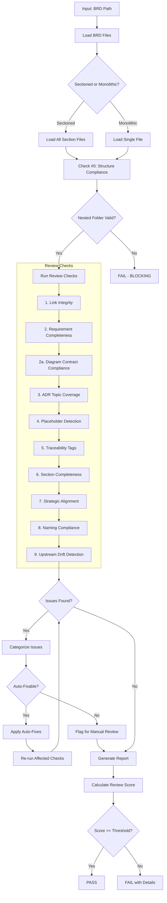
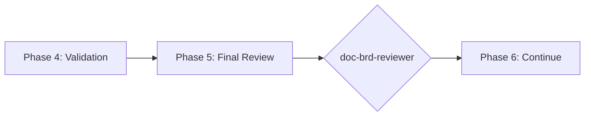

# doc-brd-reviewer

## Purpose
Comprehensive **content review and quality assurance** for Business Requirements Documents (BRD). This skill performs deep content analysis beyond structural validation, checking link integrity, requirement completeness, ADR topic coverage, strategic alignment, and identifying issues that require manual business review.

**Layer**: 1 (BRD Quality Assurance)

**Upstream**: Strategy documents, stakeholder requirements

**Downstream**: None (final QA gate before PRD generation)

---

## When to Use This Skill

Use `doc-brd-reviewer` when:

- **After BRD Generation**: Run immediately after `doc-brd-autopilot` completes
- **Manual BRD Edits**: After making manual changes to a BRD
- **Pre-PRD Check**: Before running `doc-prd-autopilot`
- **Periodic Review**: Regular quality checks on existing BRDs
- **CI/CD Integration**: Automated review gate in documentation pipelines

**Do NOT use when**:
- BRD does not exist yet (use `doc-brd` or `doc-brd-autopilot` first)
- Need structural/schema validation only (use `doc-brd-validator`)
- Generating new BRD content (use `doc-brd`)

---

## Skill vs Validator: Key Differences

| Aspect | `doc-brd-validator` | `doc-brd-reviewer` |
|--------|---------------------|-------------------|
| **Focus** | Schema compliance, PRD-Ready score | Content quality, strategic alignment |
| **Checks** | Required sections, field formats | Link integrity, ADR completeness, placeholders |
| **Auto-Fix** | Structural issues only | Content issues (links, dates, placeholders) |
| **Output** | PRD-Ready score (numeric) | Review score + issue list |
| **Phase** | Phase 4 (Validation) | Phase 5 (Final Review) |
| **Blocking** | PRD-Ready < threshold blocks | Review score < threshold flags |

---

## Review Workflow



---

## Review Checks

### 0. Structure Compliance (BLOCKING)

Validates BRD follows the mandatory nested folder rule.

**Nested Folder Rule**: ALL BRDs MUST be in nested folders regardless of size.

**Required Structure**:

| BRD Type | Required Location |
|----------|-------------------|
| Monolithic | `docs/01_BRD/BRD-NN_{slug}/BRD-NN_{slug}.md` |
| Sectioned | `docs/01_BRD/BRD-NN_{slug}/BRD-NN.0_index.md`, `BRD-NN.1_*.md`, etc. |

**Validation**:

```
1. Check document is inside a nested folder: docs/01_BRD/BRD-NN_{slug}/
2. Verify folder name matches BRD ID pattern: BRD-NN_{slug}
3. Verify file name matches folder: BRD-NN_{slug}.md or BRD-NN.N_*.md
4. Parent path must be: docs/01_BRD/
```

**Example Valid Structure**:

```
docs/01_BRD/
├── BRD-01_f1_iam/
│   ├── BRD-01_f1_iam.md           ✓ Valid (monolithic)
│   ├── BRD-01.R_review_report_v001.md
│   └── .drift_cache.json
├── BRD-02_f2_session/
│   ├── BRD-02.0_index.md          ✓ Valid (sectioned)
│   ├── BRD-02.1_core.md
│   └── BRD-02.2_requirements.md
```

**Invalid Structure**:

```
docs/01_BRD/
├── BRD-01_f1_iam.md               ✗ NOT in nested folder
```

**Auto-Fix**:

1. Create the nested folder `docs/01_BRD/BRD-NN_{slug}/`
2. Move the BRD file(s) into the folder
3. Update all internal links (navigation, cross-references)
4. Update any downstream PRD links to correct path

**Error Codes**:

| Code | Severity | Description |
|------|----------|-------------|
| REV-STR001 | Error | BRD not in nested folder (blocking) |
| REV-STR002 | Error | BRD folder name doesn't match BRD ID |
| REV-STR003 | Warning | Monolithic BRD should be sectioned (>25KB) |

**This check is BLOCKING** - BRD must pass structure validation before other checks proceed.

---

### 1. Link Integrity

Validates all internal document links resolve correctly.

**Scope**:
- Navigation links (`[Previous: ...]`, `[Next: ...]`)
- Section cross-references (for example, `See Section 7.2`)
- Index to section links
- External documentation links (warns if unreachable)

**Error Codes**:

| Code | Severity | Description |
|------|----------|-------------|
| REV-L001 | Error | Broken internal link |
| REV-L002 | Warning | External link unreachable |
| REV-L003 | Info | Link path uses absolute instead of relative |

---

### 2. Requirement Completeness

Validates all business requirements have complete specifications.

**Scope**:
- Each requirement has acceptance criteria
- Success metrics defined
- Scope boundaries clear (in/out)
- Priority assignments present
- Dependencies documented

**Error Codes**:

| Code | Severity | Description |
|------|----------|-------------|
| REV-R001 | Error | Requirement missing acceptance criteria |
| REV-R002 | Error | No success metrics defined |
| REV-R003 | Warning | Scope boundaries unclear |
| REV-R004 | Warning | Missing priority assignment |
| REV-R005 | Info | Dependency not documented |

### 2a. Diagram Contract Compliance

Validates BRD diagram contract requirements defined by `ai_dev_ssd_flow/DIAGRAM_STANDARDS.md`.

**Scope**:
- Required BRD tags: `@diagram: c4-l1`, `@diagram: dfd-l0`
- Sequence tag presence when sequence diagram is used
- Intent header fields: `diagram_type`, `level`, `scope_boundary`, `upstream_refs`, `downstream_refs`
- Trust-boundary annotations when data boundary movement is documented

**Error Codes**:

| Code | Severity | Description |
|------|----------|-------------|
| REV-DC001 | Warning | Missing recommended BRD diagram tag (`@diagram: c4-l1` or `@diagram: dfd-l0`) |
| REV-DC002 | Warning | Sequence diagram present without sequence contract tag |
| REV-DC003 | Warning | Diagram intent header missing required fields |
| REV-DC004 | Warning | Trust boundary annotation missing where expected |

---

### 3. ADR Topic Coverage

Validates Section 7.2 ADR Topics have complete coverage.

**Scope**:
- All 7 mandatory categories present (Infrastructure, Data Architecture, Integration, Security, Observability, AI/ML, Technology Selection)
- Each topic has Status, Alternatives Overview, Decision Drivers
- Selected topics have Cloud Provider Comparison table
- Deferred topics have justification

**Error Codes**:

| Code | Severity | Description |
|------|----------|-------------|
| REV-ADR001 | Error | Mandatory ADR category missing |
| REV-ADR002 | Error | Topic missing Alternatives Overview |
| REV-ADR003 | Error | Selected topic missing comparison table |
| REV-ADR004 | Warning | Topic missing Decision Drivers |
| REV-ADR005 | Info | Deferred topic needs justification |

---

### 4. Placeholder Detection

Identifies incomplete content requiring replacement.

**Scope**:
- `[TODO]`, `[TBD]`, `[PLACEHOLDER]` text
- Template dates: `YYYY-MM-DDTHH:MM:SS`, `MM/DD/YYYY`
- Template names: `[Name]`, `[Author]`, `[Reviewer]`
- Empty sections: `<!-- Content here -->`
- Lorem ipsum or sample text

**Auto-Fix**:
- Replace `YYYY-MM-DDTHH:MM:SS` with current datetime
- Replace `[Name]` with document author from metadata
- Remove empty comment placeholders
- Flag `[TODO]`/`[TBD]` for manual completion

**Error Codes**:

| Code | Severity | Description |
|------|----------|-------------|
| REV-P001 | Error | [TODO] placeholder found |
| REV-P002 | Error | [TBD] placeholder found |
| REV-P003 | Warning | Template date not replaced |
| REV-P004 | Warning | Template name not replaced |
| REV-P005 | Warning | Empty section content |

---

### 5. Traceability Tags

Validates cross-reference tags and element IDs.

**Scope**:
- `@ref:` tags reference valid documents (if upstream_mode: "ref")
- Element IDs properly formatted
- Cross-references consistent
- Traceability section completeness

**Error Codes**:

| Code | Severity | Description |
|------|----------|-------------|
| REV-TR001 | Error | Invalid document ID in metadata |
| REV-TR002 | Warning | Missing element ID |
| REV-TR003 | Info | Inconsistent cross-reference format |
| REV-TR004 | Warning | Malformed parent_doc reference |

---

### 6. Section Completeness

Verifies all 18 required sections have substantive content per BRD-MVP-TEMPLATE.

**Scope**:
- All 18 numbered sections present (plus Document Control)
- Minimum word count per section
- Required subsections for governance, traceability, glossary
- Tables have data rows (not just headers)
- Mermaid diagrams render properly

**18-Section Structure Validation**:

| # | Section | Min Words | Required Subsections |
|---|---------|-----------|----------------------|
| 1 | Introduction | 100 | 1.1-1.4 |
| 2 | Business Objectives | 150 | **2.1 MVP Hypothesis**, 2.2-2.5 |
| 3 | Project Scope | 200 | **3.2 MVP Core Features**, **3.4.1**, **3.4.2**, 3.5 |
| 4 | Stakeholders | 75 | Decision Makers + Key Contributors blocks |
| 5 | User Stories | 100 | 5.1-5.2 |
| 6 | Functional Requirements | 200 | 6.1-6.5 |
| 7 | Quality Attributes | 300 | **7.2 ADR Topics**, 7.3-7.5 |
| 8 | Business Constraints and Assumptions | 100 | 8.1-8.2 |
| 9 | Acceptance Criteria | 100 | **9.1 MVP Launch Criteria**, 9.2 |
| 10 | Business Risk Management | 150 | Risk table required |
| 11 | Implementation Approach | 100 | 11.1-11.2 |
| 12 | Support and Maintenance | 75 | 12.1-12.3 |
| 13 | Cost-Benefit Analysis | 100 | ROI summary + qualitative impact |
| 14 | Project Governance | 150 | 14.1-14.5 (**14.5 required**) |
| 15 | Quality Assurance | 100 | **15.3 Quality Gates** |
| 16 | Traceability | 150 | **16.1-16.4** (all required) |
| 17 | Glossary | 50 | **17.1-17.6** (including 17.5 Cross-References, 17.6 External Standards) |
| 18 | Appendices | 100 | 18.1-18.5 |

**MVP-Critical Subsections** (bold items above):

| Subsection | Purpose | Error if Missing |
|------------|---------|------------------|
| 2.1 MVP Hypothesis | Validates core MVP assumption | REV-MVP001 |
| 3.2 MVP Core Features | P1/P2 feature checklist | REV-MVP002 |
| 9.1 MVP Launch Criteria | Go/no-go checklist | REV-MVP003 |
| 14.5 Approval and Sign-off | Stakeholder sign-off table | REV-MVP004 |
| 15.3 Quality Gates | Quality gate checklist | REV-MVP005 |
| 16.1-16.4 | Traceability matrix subsections | REV-MVP006-009 |
| 17.1-17.6 | Glossary structure (17.5 Cross-References, 17.6 External Standards) | REV-MVP010 |

**Error Codes**:

| Code | Severity | Description |
|------|----------|-------------|
| REV-S001 | Error | Required section missing entirely |
| REV-S002 | Warning | Section below minimum word count |
| REV-S003 | Warning | Table has no data rows |
| REV-S004 | Error | Mermaid diagram syntax error |
| REV-MVP001 | Error | Missing MVP Hypothesis (Section 2.1) |
| REV-MVP002 | Warning | Missing MVP Core Features checklist (Section 3.2) |
| REV-MVP003 | Error | Missing MVP Launch Criteria (Section 9.1) |
| REV-MVP004 | Error | Missing Approval Sign-off Table (Section 14.5) |
| REV-MVP005 | Error | Missing Quality Gates (Section 15.3) |
| REV-MVP006 | Error | Missing Requirements Traceability Matrix (Section 16.1) |
| REV-MVP007 | Warning | Missing Cross-BRD Dependencies (Section 16.2) |
| REV-MVP008 | Warning | Missing Test Coverage Traceability (Section 16.3) |
| REV-MVP009 | Warning | Missing Traceability Summary (Section 16.4) |
| REV-MVP010 | Warning | Missing Glossary subsection structure (17.1-17.6) |

#### 6.1 Subsection Validation Algorithm

```
FOR each section in 18_SECTION_LIST:
  1. Verify section header exists: "## {N}. {Title}"
  2. Count words in section content
  3. IF section has required_subsections:
     FOR each subsection in required_subsections:
       - Search for header pattern: "### {N}.{M}" or "#### {N}.{M}.{X}"
       - IF not found: Add appropriate error code
       - IF found: Validate minimum content (>10 words)
  4. IF section < minimum_words: Add REV-S002 warning
```

**Section Detection Patterns**:

| Section Type | Pattern | Example |
|--------------|---------|---------|
| Main section | `## N. Title` | `## 14. Project Governance` |
| Subsection | `### N.M Title` | `### 14.5 Approval and Sign-off` |
| Sub-subsection | `#### N.M.X Title` | `#### 16.1.1 Business Objectives → FRs` |

**Sectioned BRD Handling**:

For sectioned BRDs (BRD-NN.N_*.md files):
1. Map file to section number from filename pattern
2. Validate section content within that file
3. Cross-reference section numbering consistency

| File Pattern | Section |
|--------------|---------|
| BRD-NN.14_*.md | Section 14 (Governance) |
| BRD-NN.15_*.md | Section 15 (Quality Assurance) |
| BRD-NN.16_*.md | Section 16 (Traceability) |
| BRD-NN.17_*.md | Section 17 (Glossary) |

---

### 7. Strategic Alignment

Validates BRD aligns with business strategy and objectives.

**Scope**:
- Business objectives trace to strategic goals
- Success metrics align with KPIs
- Scope matches project charter
- Stakeholder concerns addressed
- Implementation-derived content is translated into business-language outcomes

**Error Codes**:

| Code | Severity | Description |
|------|----------|-------------|
| REV-SA001 | Warning | Business objective not traced to strategy |
| REV-SA002 | Info | Success metric may not align with KPI |
| REV-SA003 | Warning | Scope may exceed project charter |
| REV-SA004 | Flag | Requires stakeholder review |
| REV-SA005 | Warning | Implementation-heavy wording not abstracted to BRD business language |

---

### 8. Naming Compliance

Validates element IDs follow `doc-naming` standards.

**Scope**:
- Element IDs use `BRD.NN.TT.SS` format
- Element type codes valid for BRD (01, 02, 03, 04, 05, 06, 07, 08, 09, 10, 22, 23, 24, 32, 33)
- No legacy patterns (BO-NNN, FR-NNN, etc.)

**Auto-Fix**:
- Convert legacy patterns to unified format
- Suggest correct element type codes

**Error Codes**:

| Code | Severity | Description |
|------|----------|-------------|
| REV-N001 | Error | Invalid element ID format |
| REV-N002 | Error | Element type code not valid for BRD |
| REV-N003 | Error | Legacy pattern detected |
| REV-N004 | Warning | Inconsistent ID sequencing |

---

### 9. Upstream Drift Detection (Conditional)

Detects when upstream reference documents have been modified after the BRD was created. **This check is CONDITIONAL** based on `upstream_mode` setting.

#### 9.0 Mode Detection (First Step)

**Before running drift detection**:

1. Read YAML frontmatter `custom_fields.upstream_mode`
2. Apply behavior:

| upstream_mode | Action | Score |
|---------------|--------|-------|
| `"none"` (default) | Skip Check #9 entirely | 5/5 automatic |
| `"ref"` | Run drift detection on `upstream_ref_path` | Calculated |
| *(not set)* | Treat as `"none"` | 5/5 automatic |

**If skipping**:
- Log: `INFO: Upstream drift detection skipped (upstream_mode: none)`
- Award full 5/5 points
- Create minimal drift cache entry

**Scope** (when `upstream_mode: "ref"`):
- Documents in paths specified by `upstream_ref_path`
- `@ref:` tag targets within those paths
- Traceability section upstream artifact links
- GAP analysis document references

---

#### 9.1 Drift Cache File (MANDATORY)

**Location**: `docs/01_BRD/{BRD_folder}/.drift_cache.json`

**IMPORTANT**: The reviewer MUST:
1. **Read** the cache if it exists (for hash comparison)
2. **Create** the cache if it doesn't exist
3. **Update** the cache after every review with current hashes

**Cache Schema** (when `upstream_mode: "none"` or not set):

```json
{
  "schema_version": "1.1",
  "document_id": "BRD-01",
  "document_version": "1.0",
  "upstream_mode": "none",
  "upstream_ref_path": null,
  "drift_detection_skipped": true,
  "skip_reason": "upstream_mode set to none (default)",
  "last_reviewed": "2026-02-24T21:00:00",
  "reviewer_version": "1.6",
  "upstream_documents": {},
  "review_history": [
    {
      "date": "2026-02-24T21:00:00",
      "score": 97,
      "drift_detected": false,
      "report_version": "v001"
    }
  ]
}
```

**Cache Schema** (when `upstream_mode: "ref"`):

```json
{
  "schema_version": "1.1",
  "document_id": "BRD-01",
  "document_version": "1.0",
  "upstream_mode": "ref",
  "upstream_ref_path": ["../../00_REF/source_docs/"],
  "drift_detection_skipped": false,
  "last_reviewed": "2026-02-24T21:00:00",
  "reviewer_version": "1.6",
  "upstream_documents": {
    "../../00_REF/source_docs/BeeLocal_BRD_v2.1.md": {
      "hash": "sha256:c9810281...",
      "last_modified": "2024-12-25T00:00:06",
      "file_size": 76908,
      "version": "2.1",
      "sections_tracked": []
    }
  },
  "review_history": [
    {
      "date": "2026-02-24T21:00:00",
    PRD-Ready Score = 100 - total_deductions
      "drift_detected": false,
      "report_version": "v001"
    }
  ]
}
```

---

#### 9.2 Detection Algorithm (Three-Phase)

```
PHASE 1: Load Cache (if exists)
=========================================
1. Check for .drift_cache.json in BRD folder
2. If exists:
   - Load cached hashes and metadata
   - Set detection_mode = "hash_comparison"
3. If not exists:
   - Set detection_mode = "timestamp_only"
   - Will create cache at end of review

PHASE 2: Detect Drift
=========================================
For each upstream reference in BRD:

  A. Extract reference:
     - @ref: tags → [path, section anchor]
     - @strategy: tags → [document ID]
     - Links to ../00_REF/ → [path]
     - Traceability table upstream artifacts → [path]

  B. Resolve and validate:
     - Resolve path to absolute file path
     - Check file exists (skip if covered by Check #1)
     - Get file stats: mtime, size

  C. Compare (based on detection_mode):

     IF detection_mode == "hash_comparison":
       - Compute SHA-256 hash of current file content
       - Compare to cached hash
       - IF hash differs:
           - Calculate change_percentage
           - Flag as CONTENT_DRIFT (REV-D002)
           - IF change > 20%: Flag as CRITICAL (REV-D005)

     ELSE (timestamp_only):
       - Compare file mtime > BRD last_updated
       - IF mtime > BRD date:
           - Flag as TIMESTAMP_DRIFT (REV-D001)

  D. Check version field (if YAML frontmatter):
     - Extract version from upstream doc
     - Compare to cached version
     - IF version incremented: Flag REV-D003

PHASE 3: Update Cache (MANDATORY)
=========================================
1. Compute SHA-256 hash for ALL upstream documents
2. Create/update .drift_cache.json with:
   - Current hashes
   - Current timestamps
   - Current file sizes
   - Review metadata
3. Append to review_history array
```

---

#### 9.3 Hash Calculation (MANDATORY BASH EXECUTION)

**CRITICAL**: You MUST execute actual bash commands to compute hashes. DO NOT write placeholder values like `verified_no_drift` or `pending_verification`.

##### 9.3.1 Compute File Hash

Execute this bash command for each upstream document:

```bash
sha256sum <file_path> | cut -d' ' -f1
```

**Example**:
```bash
sha256sum docs/00_REF/project_governance/engineering_standards.md | cut -d' ' -f1
# Output: a9ca05f4e9b2379465526221271672954feff29e40c57f2a91fe8a050eb46105
```

Store result in drift cache as: `"hash": "sha256:<64_hex_characters>"`

##### 9.3.2 Hash Format Validation

Before writing to drift cache, validate the hash:

| Check | Requirement | Action if Failed |
|-------|-------------|------------------|
| Prefix | Must be `sha256:` | Add prefix |
| Length | Exactly 64 hex characters after prefix | Re-run sha256sum |
| Characters | `[0-9a-f]` only | Re-run sha256sum |
| Placeholders | Must NOT be placeholder | Re-run sha256sum |

**REJECTED VALUES** (re-compute immediately if found):
- `sha256:verified_no_drift`
- `sha256:pending_verification`
- `pending_verification`
- `sha256:TBD`
- Any value where hex portion != 64 characters

##### 9.3.3 Verification After Cache Write

After updating `.drift_cache.json`, verify hashes are valid:

```bash
# Verify all hashes match valid format
grep -oP '"hash":\s*"sha256:[0-9a-f]{64}"' .drift_cache.json

# Check for any placeholder values (must return empty)
grep -E '"hash":\s*"(sha256:)?(verified_no_drift|pending_verification|TBD)"' .drift_cache.json
```

If verification fails, re-run sha256sum and update cache before proceeding.

##### 9.3.4 Hash Comparison Algorithm

When comparing hashes for drift detection:

1. **Read stored hash** from `.drift_cache.json`
2. **Validate stored hash** - if placeholder, flag REV-D009 and compute real hash
3. **Compute current hash** via bash:
   ```bash
   CURRENT_HASH=$(sha256sum <upstream_file> | cut -d' ' -f1)
   ```
4. **Compare**:
   - If `CURRENT_HASH != stored_hash` → Flag REV-D002 (CONTENT_DRIFT)
   - If hashes match → No drift
5. **Update cache** with current hash and timestamp

---

#### 9.4 Error Codes

| Code | Severity | Description | Trigger |
|------|----------|-------------|---------|
| REV-D001 | Warning | Upstream document modified after BRD creation | mtime > BRD date (no cache) |
| REV-D002 | Warning | Referenced content has changed | hash mismatch (with cache) |
| REV-D003 | Info | Upstream document version incremented | version field changed |
| REV-D004 | Info | New content added to upstream | file size increased >10% |
| REV-D005 | Error | Critical modification (>20% change) | hash diff >20% |
| REV-D006 | Info | Cache created (first review) | no prior cache existed |
| REV-D007 | Info | Drift detection skipped | upstream_mode: "none" |
| REV-D008 | Warning | upstream_ref_path not found | specified path doesn't exist |
| REV-D009 | Error | Invalid hash placeholder detected | hash is `verified_no_drift`, `pending_verification`, or invalid format |

---

#### 9.5 Report Output

```markdown
## 9. Upstream Drift Detection (5/5)

### Cache Status

| Field | Value |
|-------|-------|
| Cache File | `.drift_cache.json` |
| Cache Status | ✅ Updated |
| Detection Mode | Hash Comparison |
| Documents Tracked | 2 |

### Upstream Document Analysis

| Upstream Document | Hash Status | Last Modified | Change % | Status |
|-------------------|-------------|---------------|----------|--------|
| F1_IAM_Technical_Specification.md | ✅ Match | 2026-02-10T15:34:26 | 0% | Current |
| GAP_Foundation_Module_Gap_Analysis.md | ✅ Match | 2026-02-10T15:34:21 | 0% | Current |

### Drift Summary

| Status | Count | Details |
|--------|-------|---------|
| ✅ Current | 2 | All upstream documents synchronized |
| ⚠️ Warning | 0 | No drift detected |
| ❌ Critical | 0 | No major changes |

**Cache updated**: 2026-02-10T17:00:00
```

---

#### 9.6 Configuration

| Setting | Default | Description |
|---------|---------|-------------|
| `cache_enabled` | **true** | **Mandatory** - always create/update cache |
| `drift_threshold_days` | 7 | Days before timestamp drift becomes Warning |
| `critical_change_pct` | 20 | Percentage change for critical drift |
| `track_sections` | true | Track individual section hashes for anchored refs |
| `max_history_entries` | 10 | Maximum review_history entries to retain |

---

## Review Score Calculation

**Canonical Source of Truth**:
- `ai_dev_ssd_flow/01_BRD/BRD_MVP_VALIDATION_RULES.md` (deduction model)
- `ai_dev_ssd_flow/01_BRD/README.md` (quality-gate interpretation)

**Scoring Formula (Deduction-Based)**:

`PRD-Ready Score = 100 - total_deductions`

| Deduction Category | Max Deduction | Rule Summary |
|--------------------|---------------|--------------|
| PRD-level content contamination | 50 | Code blocks and technical/UI implementation language in BRD business sections |
| FR structure completeness | 30 | Missing required FR subsections and invalid cross-references |
| Document structure and quality | 20 | Missing required sections, document control gaps, revision history issues |

**Total**: `100 - total_deductions` (bounded to `0..100`)

**Blocking Note**: Structure compliance check remains blocking. If structure validation fails (e.g., REV-STR001), the review cannot pass regardless of computed score.

**Thresholds**:
- **PASS**: ≥ 90 (configurable)
- **FAIL**: < 90

**Workflow Gate Interpretation**:
- `>=90`: PRD-ready gate satisfied
- `<90`: not PRD-ready, must route to fix cycle/manual remediation

---

## Command Usage

### Basic Usage

```bash
# Review specific BRD
/doc-brd-reviewer BRD-01

# Review BRD by path
/doc-brd-reviewer docs/01_BRD/BRD-01_platform/

# Review all BRDs
/doc-brd-reviewer all
```

### Options

| Option | Default | Description |
|--------|---------|-------------|
| `--min-score` | 90 | Minimum passing review score |
| `--auto-fix` | true | Apply automatic fixes |
| `--no-auto-fix` | false | Disable auto-fix (report only) |
| `--check` | all | Specific checks to run (comma-separated) |
| `--skip` | none | Checks to skip (comma-separated) |
| `--verbose` | false | Detailed output per check |
| `--report` | true | Generate markdown report |

---

## Output Report

Review reports are stored alongside the reviewed document per project standards.

**Nested Folder Rule**: ALL BRDs use nested folders (`BRD-NN_{slug}/`) regardless of size. This ensures review reports, fix reports, and drift cache files are organized with their parent document.

**File Naming**: `BRD-NN.R_review_report_vNNN.md`

**Location**: Inside the BRD nested folder: `docs/01_BRD/BRD-NN_{slug}/`

### Versioning Rules

1. **First Review**: Creates `BRD-NN.R_review_report_v001.md`
2. **Subsequent Reviews**: Auto-increments version (v002, v003, etc.)
3. **Same-Day Reviews**: Each review gets unique version number

**Version Detection Algorithm**:

```
1. Scan folder for pattern: BRD-NN.R_review_report_v*.md
2. Extract highest version number (N)
3. Create new file with version (N + 1)
```

**Example**:

```
docs/01_BRD/BRD-03_f3_observability/
├── BRD-03.R_review_report_v001.md    # First review
├── BRD-03.R_review_report_v002.md    # After fixes
└── BRD-03.R_review_report_v003.md    # Final review
```

### Delta Reporting

When previous reviews exist, include score comparison:

```markdown
## Score Comparison

| Metric | Previous (v002) | Current (v003) | Delta |
|--------|-----------------|----------------|-------|
| Overall Score | 85 | 94 | +9 |
| Errors | 3 | 0 | -3 |
| Warnings | 5 | 2 | -3 |
```

See `REVIEW_DOCUMENT_STANDARDS.md` for complete requirements.

---

## Integration with doc-brd-autopilot

This skill is invoked during Phase 5 of `doc-brd-autopilot`:



---

## Related Skills

| Skill | Relationship |
|-------|--------------|
| `doc-naming` | Naming standards for Check #8 |
| `doc-brd-autopilot` | Invokes this skill in Phase 5 |
| `doc-brd-validator` | Structural validation (Phase 4) |
| `doc-brd-fixer` | Applies fixes based on review findings |
| `doc-brd` | BRD creation rules |
| `doc-prd-autopilot` | Downstream consumer |

---

## Version History

| Version | Date | Changes |
|---------|------|---------|
| 1.9 | 2026-02-27T16:30:00 | **Fixed drift detection hash computation**: Section 9.3 now requires mandatory bash `sha256sum` execution; Added hash format validation (Section 9.3.2); Added placeholder rejection list; Added verification step (Section 9.3.3); Added comparison algorithm (Section 9.3.4); Added REV-D009 error code for invalid hash placeholders |
| 1.2 | 2026-02-26T12:45:00 | **Unified template-based versioning**: Skill version now tracks `ai_dev_ssd_flow/01_BRD/BRD-MVP-TEMPLATE` schema version to avoid cross-skill version drift. |
| 1.8 | 2026-02-26T12:30:00 | **Template compliance correction**: Aligned Check #6 subsection contract to `ai_dev_ssd_flow/01_BRD/BRD-MVP-TEMPLATE.md` v1.2; corrected mismatched requirements (1.1-1.4, 3.4.1/3.4.2, 5.1-5.2, 12.1-12.3, 18.1-18.5) and clarified glossary requirements as 17.5 Cross-References + 17.6 External Standards. |
| 1.7 | 2026-02-25T11:00:00 | **Template alignment**: Check #6 updated for 18-section structure validation; Added MVP-critical subsection validation (2.1, 3.2, 9.1, 14.5, 15.3, 16.1-16.4, 17.1-17.6); Added REV-MVP001-MVP010 error codes; Updated scoring formula (28-point validation: 18 sections + 10 MVP subsections) |
| 1.6 | 2026-02-24T21:30:00 | **Conditional drift detection**: Check #9 now skipped when `upstream_mode: "none"` (default); Removed @strategy: tag references; Updated drift cache schema to v1.1 with upstream_mode and drift_detection_skipped fields; Added REV-D007 (drift skipped) and REV-D008 (path not found) error codes; Updated scoring formula for conditional check |
| 1.5 | 2026-02-11T18:00:00 | **Structure Compliance**: Added Check #0 for nested folder rule enforcement (REV-STR001-STR003); Updated workflow diagram with structure validation decision node; Added structure compliance to scoring (12% weight, blocking); Consistent with other reviewer skills |
| 1.4 | 2026-02-10T17:00:00 | **Mandatory drift cache**: Reviewer MUST create/update `.drift_cache.json` after every review; Three-phase detection algorithm; SHA-256 hash computation; Hash comparison mode when cache exists; REV-D006 code for cache creation; Cache schema with review_history tracking |
| 1.3 | 2026-02-10T14:30:00 | Added Check #9: Upstream Drift Detection - detects when source documents modified after BRD creation; REV-D001-D005 error codes; drift cache support; configurable thresholds |
| 1.2 | 2026-02-10 | Added element type code 33 (Benefit Statement) to valid BRD codes per doc-naming v1.5 |
| 1.1 | 2026-02-10 | Added review versioning support (_vNNN pattern); Delta reporting for score comparison |
| 1.0 | 2026-02-10 | Initial skill creation with 8 review checks; ADR topic coverage validation; Strategic alignment check |
