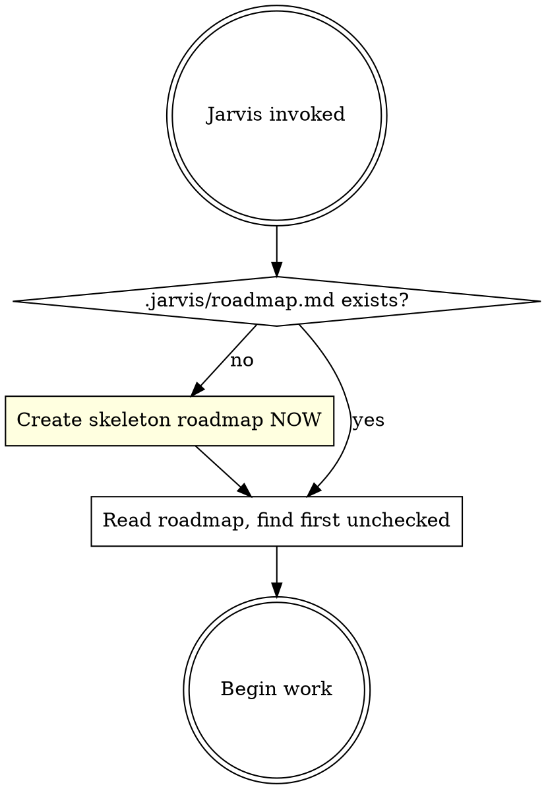

# Jarvis

Structured execution for multi-step development work. Creates `.jarvis/roadmap.md` as a state machine on the VERY FIRST action, then uses it to gate every subsequent step. Resumes from any unchecked item.

## When to Use

- Implementing a new feature from a PRD, spec, or description
- Large refactors spanning multiple files or modules
- System migrations (database, framework, API version)
- Integration work connecting multiple services or systems
- Tech debt cleanup requiring coordinated changes
- Infrastructure changes (CI/CD, deployment, monitoring)
- Any complex work needing structured phases + tracked progress
- Resuming interrupted work (`.jarvis/roadmap.md` already exists)

## When NOT to Use

- Single-file bug fixes or small tweaks
- Tasks where the user gave exact code to write
- Pure research or exploration tasks

## Resume After Context Compaction

When resuming after context compaction or in a new session:

1. **Re-invoke the Jarvis skill** to reload these instructions into context.
2. **READ `.jarvis/roadmap.md`** to find current state.
3. **Find the first unchecked item** and continue from there.
4. Do NOT re-do checked items. Do NOT skip unchecked items.

The roadmap is the source of truth — not your memory of what happened before compaction.

## Step Zero: Create the Roadmap IMMEDIATELY

**This is non-negotiable. Before ANY thinking, exploring, or brainstorming, create `.jarvis/roadmap.md`.**

The roadmap is not a planning artifact — it is the state machine that gates all work. If it doesn't exist, nothing else can proceed.



On first invocation, write this skeleton immediately:

```markdown
# Task: [user's request, verbatim]

**Source:** [user message / spec path]
**Started:** [date]
**Type:** [feature | refactor | migration | integration | infrastructure | tech-debt]

## Phase 0: Setup
- [x] Roadmap created
- [ ] Brainstorming complete (.jarvis/design.md written)
- [ ] Design approved by user

## Phase 1: Research & Planning
- [ ] Deep-read codebase, find reference implementations
- [ ] Write .jarvis/research.md
- [ ] Implementation plan written (.jarvis/plan.md)
- [ ] Tasks populated in this roadmap
- [ ] User annotation cycle (repeat until approved)
- [ ] Execution mode chosen (subagent-driven / parallel / manual)
- [ ] /multi review passed

## Phase 2: Implementation
(populated after Phase 1)

## Phase 3: Integration
- [ ] Full test suite passes
- [ ] E2E test suite passes
- [ ] Cross-task integration verified
- [ ] Verification complete (superpowers:verification-before-completion)
- [ ] /multi review passed
- [ ] Branch finished (superpowers:finishing-a-development-branch)
```

Check off "Roadmap created" immediately. Now proceed to the first unchecked item.

## Phase Gates

**EVERY phase transition requires reading `.jarvis/roadmap.md` and verifying all items in the current phase are checked.**

```
GATE: Before starting Phase 1
  → READ .jarvis/roadmap.md
  → Are ALL Phase 0 items checked? If NO → STOP. Complete them.

GATE: Before starting Phase 2
  → READ .jarvis/roadmap.md
  → Are ALL Phase 1 items checked (research, plan, annotation, /multi)? If NO → STOP. Complete them.

GATE: Before starting Phase 3
  → READ .jarvis/roadmap.md
  → Are ALL Phase 2 tasks checked? If NO → STOP. Complete them.

GATE: Before claiming "done"
  → READ .jarvis/roadmap.md
  → Are ALL Phase 3 items checked? If NO → STOP. Complete them.
```

Reading the file forces you to confront actual state, not assumed state.

## Anti-Skip Rationalizations

If you are thinking any of these, you are about to skip a step. STOP.

| Thought | What to do instead |
|---------|-------------------|
| "The user said 'go', I should produce code fast" | READ roadmap.md. What's the next unchecked item? Do that. |
| "I already know what to build, brainstorming is overhead" | Roadmap says brainstorming is unchecked. Do it. |
| "I'll create the roadmap after I get the design done" | The roadmap IS Step Zero. It should already exist. |
| "The /multi review will slow us down" | Check it off or don't proceed. Those are your only options. |
| "I can dispatch subagents now and review later" | READ roadmap.md. Is the previous gate passed? |
| "The subagent already wrote code, the process ship has sailed" | It hasn't. Run the review. Fix issues. Check it off. |
| "This task is simple enough to skip the design doc" | Write a 3-line design doc. Still counts. |
| "I'll check off items in batch later" | Check off NOW. The roadmap is only useful if current. |
| "I don't need to research, I can just plan" | Research is unchecked. Write research.md first. |
| "The user already approved, I can tweak the plan myself" | If /multi changes the plan materially, re-present to user. |
| "I have a better idea than what the plan says" | Phase 2 is mechanical. Revise the plan or follow it. |

## Superpowers Integration

Use superpowers skills at every applicable phase. Do not skip them.

| Jarvis Phase | Superpowers Skill | When |
|---|---|---|
| Phase 0 | `superpowers:brainstorming` | Always -- explore intent and requirements before architecture |
| Phase 1 (Research) | -- | Always -- deep-read codebase and produce `research.md` before planning |
| Phase 1 (Plan) | `superpowers:writing-plans` | Always -- structure the task plan |
| Phase 1 (Annotate) | -- | Always -- present plan for user annotation, iterate until approved |
| Phase 2 (Implement) | `superpowers:dispatching-parallel-agents` | When 2+ tasks are unblocked and independent |
| Phase 2 (Test) | `superpowers:test-driven-development` | When the task is suitable for TDD (testable logic, clear inputs/outputs) |
| Phase 2 (Debug) | `superpowers:systematic-debugging` | When tests fail or unexpected behavior occurs |
| Phase 3 | `superpowers:verification-before-completion` | Always -- verify before claiming done |
| Post-Phase 3 | `superpowers:finishing-a-development-branch` | When work is ready to integrate |

## Phases

### Phase 0: Setup (Brainstorming & Design)

1. **Create `.jarvis/roadmap.md`** — skeleton (see Step Zero above). Check off immediately.
2. **Run `superpowers:brainstorming`** — explore intent, requirements, design through dialogue.
3. **Write `.jarvis/design.md`** — validated design output. Check off in roadmap.
   - Note: `superpowers:brainstorming` writes to `docs/plans/`. After it finishes, **move or copy** the output to `.jarvis/design.md`. Jarvis artifacts live in `.jarvis/`, not `docs/plans/`.
4. **Get user approval** on the design. Check off in roadmap.

**GATE: All Phase 0 items must be checked before proceeding to Phase 1.**

### Phase 1: Research & Planning

Phase 1 has three distinct sub-phases. Do not collapse them.

#### 1a. Research (Context Engineering)

Context quality drives development velocity. Invest in understanding before planning.

1. **Deep-read** the codebase areas relevant to the task spec/PRD — guided by the intent established during brainstorming. Read deeply, not broadly. Understand intricacies, edge cases, and existing patterns in the areas this change will touch.
2. **Write `.jarvis/research.md`** — task-specific findings: how the affected system areas currently work, relevant patterns, constraints, gotchas, and integration points. This builds on top of `CLAUDE.md` (project-wide conventions) — do not repeat what's already there.
3. **Find reference implementations** — search for concrete examples in the codebase or established open-source projects that solve similar problems. Link them in `research.md`. Grounding plans in real code produces dramatically better architecture than designing from scratch. If no relevant reference exists (greenfield/novel work), document the search attempt and proceed with stated assumptions.

Check off research items in roadmap.

#### 1b. Planning

1. **Run `superpowers:writing-plans`** — create detailed implementation plan informed by `research.md`.
2. **Write `.jarvis/plan.md`** — the plan output. Check off in roadmap.
   - Note: `superpowers:writing-plans` writes to `docs/plans/`. After it finishes, **move or copy** the output to `.jarvis/plan.md`. Jarvis artifacts live in `.jarvis/`, not `docs/plans/`.
3. **Populate Phase 2** in `.jarvis/roadmap.md` with task-level checkboxes from the plan.
4. **Choose execution mode** — ask the user: subagent-driven (same session), parallel session, or manual. Check off in roadmap.

#### 1c. Annotation Cycle (Plan Refinement)

The plan is a shared mutable document. Iterate on it before any code is written.

1. Present the plan to the user for review.
2. The user annotates with inline corrections, rejected approaches, domain constraints, or missing context.
3. Revise the plan based on annotations — do not implement yet.
4. Repeat until the user approves (typically 1-3 rounds). Check off in roadmap.
5. **Run `/multi` review** on the final plan. Address critical feedback. If `/multi` feedback materially changes the approved plan, re-present the revised plan to the user for approval before proceeding. Check off.

**GATE: All Phase 1 items must be checked before proceeding to Phase 2.**

### Phase 2: Execution

Phase 2 execution is **delegated to the chosen execution skill**:

- **Subagent-Driven** (same session): Invoke `superpowers:subagent-driven-development`. It handles its own per-task review cycle (implementer → spec review → code quality review).
- **Parallel Session**: Invoke `superpowers:executing-plans`. It handles batch execution with human review checkpoints.

**Jarvis tracks progress at the TASK level** in roadmap.md. The execution skill handles sub-steps within each task.

After EACH task completes per the execution skill, **immediately update roadmap.md**:
```markdown
- [x] TASK-001: [title]
```

If the execution skill is not used (manual execution), follow this per-task cycle and **use sub-step checkboxes** in roadmap.md:

```markdown
### TASK-001: [title]
> Blocked by: (none)
- [ ] Design (.jarvis/tasks/TASK-001.md)
- [ ] Implement (TDD when suitable)
- [ ] Verify (full suite + e2e pass)
- [ ] Self-review (lint + typecheck)
- [ ] Commit
```

1. **Design** — Write approach in `.jarvis/tasks/TASK-NNN.md`. Check off.
2. **Implement** — Use `superpowers:test-driven-development` (red → green → refactor) when the task has testable logic with clear inputs/outputs. Otherwise, implement then write tests. Check off.
3. **Verify** — Full test suite + e2e. Use `superpowers:systematic-debugging` if stuck. Check off.
4. **Self-review** — Lint + typecheck. Check off.
5. **Commit** — Atomic commit (with user approval). Check off.

**GATE: All Phase 2 tasks must be checked before proceeding to Phase 3.**

### Phase 3: Integration

1. Run full test suite (unit + e2e)
2. Fix cross-task integration issues
3. Run `superpowers:verification-before-completion` — evidence before assertions
4. Final cleanup
5. **Run `/multi` review** on complete implementation. Address critical feedback.
6. Run `superpowers:finishing-a-development-branch`

Check off each item immediately.

## E2E Testing

Unit tests alone are insufficient. E2E tests are **required** when the project has user-facing surfaces.

- **Frontend**: Use `agent-browser` — navigate pages, click buttons, verify results, take screenshots.
- **Backend APIs**: Use `curl` — verify status codes, response bodies, error cases.
- **Both**: Projects with frontend + backend get both.

## Review Gates

After completing each phase, run `/multi` for external review:

```
Phase completed → Summarize what was done → /multi review → Address feedback → Check off in roadmap
```

Include in review input:
- What was completed
- Key files changed
- Decisions and rationale
- Focus areas (architecture, correctness, maintainability)

Fix critical issues before proceeding.

## Artifact Locations

**When Jarvis is active, ALL artifacts go into `.jarvis/`.** The `docs/plans/` path is for non-Jarvis work.

```
<project>/
  .jarvis/
    roadmap.md              # State machine (created at Step Zero)
    design.md               # Phase 0 output (brainstorming result)
    research.md             # Phase 1a output (codebase findings, reference implementations)
    plan.md                 # Phase 1b output (implementation plan)
    tasks/
      TASK-001.md           # Per-task design
      TASK-002.md
```

Add `.jarvis/` to `.gitignore` if artifacts should not be committed, or keep tracked for team visibility.

Implementation code and tests go wherever existing codebase conventions dictate.

## Rules

1. **Roadmap is Step Zero** — `.jarvis/roadmap.md` is created BEFORE any other action
2. **Gates are mandatory** — READ roadmap.md at every phase transition, verify all items checked
3. **No code before design** — `.jarvis/design.md` must exist and be approved first
4. **No implementation before plan** — `.jarvis/research.md` and `.jarvis/plan.md` must exist, and the user must have approved through the annotation cycle (Phase 1c)
5. **Implementation is mechanical, not creative** — once the plan is approved, follow it. Do not invent new approaches, expand scope, or redesign during Phase 2. If the plan is wrong, stop and revise it — don't improvise
6. **Tests are mandatory** — every task must have tests that pass. Use TDD when suitable; otherwise write tests after implementation
7. **E2E tests for user-facing work** — agent-browser for frontend, curl for backend APIs
8. **Use superpowers skills** — invoke applicable skills at every phase (see table)
9. **Check off immediately** — update roadmap.md right after each step completes, not in batch
10. **Respect dependency order** — skip blocked tasks, come back when unblocked
11. **Commit after each task** — atomic commit per task (with user approval)
12. **Stop on failure** — deterministic failures: investigate root cause immediately. Intermittent: retry up to 3 times, then ask user
13. **Review before proceeding** — run `/multi` after each phase; fix critical issues first

## Common Mistakes

| Mistake | Fix |
|---------|-----|
| Thinking about the task before creating roadmap | Roadmap is Step Zero. Create it FIRST. |
| Putting artifacts in docs/plans/ during Jarvis | All Jarvis artifacts go in .jarvis/ |
| Jumping to code without design approval | Phase gate blocks this. READ roadmap.md. |
| Dispatching subagents without Phase 1 gate | READ roadmap.md. Is Phase 1 complete? |
| Forgetting to check off steps | Check off IMMEDIATELY. Stale roadmap = broken state machine. |
| Skipping `/multi` review | Mandatory at phase gates. No exceptions. |
| Skipping tests entirely | Tests are mandatory. Use TDD when suitable, otherwise write tests after. |
| Two orchestrators competing | Jarvis tracks tasks; execution skill handles sub-steps. |
| Claiming "done" without verification | Run `superpowers:verification-before-completion` first. |
| Batch-checking items at the end | Each item checked the moment it completes. |
| Skipping research / no `research.md` | Deep-read the codebase and write findings before planning. |
| Planning without reference implementations | Find concrete examples in codebase or open-source before designing. |
| Skipping user annotation cycle | Present the plan, get corrections, revise — repeat until approved. |
| Getting creative during implementation | Phase 2 is mechanical execution. If the plan is wrong, revise it — don't improvise. |
