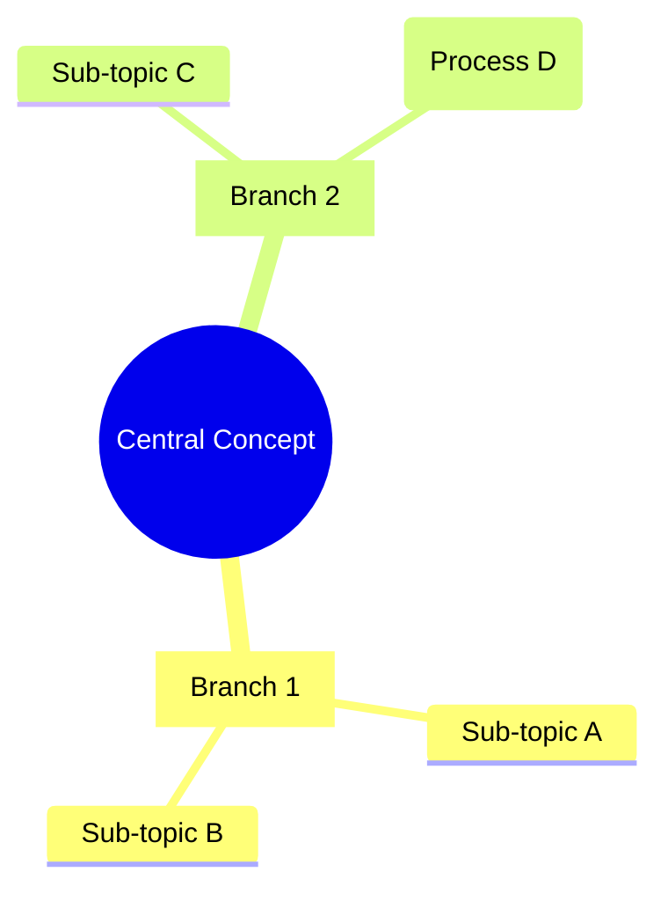

# Mind Map

Analyze source material and produce a Mermaid `mindmap` diagram with 2-4 levels of branching hierarchy.

## Reference Files

| File | Read When |
|------|-----------|
| `references/mermaid-syntax.md` | Default: mind map node shapes, indentation, icons, known limitations |
| `references/generation-guidelines.md` | Default: node text constraints, depth control, source-type strategies |
| `references/mermaid-reference.md` | Generating non-mind-map Mermaid diagrams or needing broader syntax |

## Workflow

Copy this checklist to track progress:

```text
Mind map progress:
- [ ] Step 1: Determine source type
- [ ] Step 2: Set scope (depth, budget, central concept)
- [ ] Step 3: Extract structure
- [ ] Step 4: Generate Mermaid mind map
- [ ] Step 5: Validate output
- [ ] Step 6: Present to user
```

### Step 1: Determine source type

Identify which source type applies and run the corresponding discovery actions:

- **Topic exploration**: User names a concept. Ask one clarifying question about scope or audience if ambiguous. No file scanning needed.
- **Codebase overview**: Scan project structure. Read key config files (`package.json`, `pyproject.toml`, etc.). Map modules, entry points, and dependencies.
- **File/document summary**: Read the target file. Extract key themes, sections, and relationships between ideas.
- **Feature planning / debugging**: Gather requirements or symptoms. Decompose into components, phases, or possible causes.

### Step 2: Set scope

Choose a depth level using the table in `references/generation-guidelines.md` (overview, standard, or detailed). Ask the user only if unclear. Default to **standard** (3 levels, 15-30 nodes).

Set the central concept: one clear noun or short phrase (1-3 words) for the root node. Total node budget: 40 max.

### Step 3: Extract structure

- Identify 3-7 main branches from the source material (5 is ideal).
- For each branch, identify 2-5 sub-nodes per the depth setting.
- Group related concepts under the same branch.
- Each node must be a single keyword or short phrase, never a sentence.
- See `references/generation-guidelines.md` for node text word limits and keyword extraction techniques.

### Step 4: Generate Mermaid mind map

Load `references/mermaid-syntax.md` for exact syntax. Generate inside a fenced `mermaid` code block.

Use node shapes intentionally (see `references/generation-guidelines.md` for the full shape strategy):
- Root: `((circle))` for the central concept
- Main branches: `[square]` for categories, `(rounded)` for processes
- Leaf nodes: default for general items, `{cloud}` for uncertain items

### Step 5: Validate

Run these checks before presenting. If any fail, revise and re-check:

- [ ] Total node count (including root) is 40 or fewer
- [ ] Maximum depth does not exceed selected level
- [ ] No node text exceeds 6 words
- [ ] Root node text is 1-3 words
- [ ] Each main branch has 2-7 children
- [ ] No single-child branches (merge upward if found)
- [ ] No unescaped `()[]{}` in plain-text nodes (will break Mermaid parsing)
- [ ] Branch depths are balanced (within 1 level of each other)

### Step 6: Present output

Output the mind map in a fenced `mermaid` code block:

````

````

Note where it renders: GitHub markdown, Mermaid Live Editor, VS Code with Mermaid extension.

If the user requests a file, write to a `.md` file containing the fenced block.

## Anti-patterns

- Sentences as node labels (split into parent concept with child details instead)
- Depth beyond 4 levels (Mermaid becomes unreadable; split into multiple maps)
- More than 40 nodes (split into multiple focused maps)
- Adding icons unless requested (require Font Awesome, may not render)
- Mixing `mindmap` with other Mermaid diagram types in one code block

## Related skills

- `creating-presentations` for slide decks that complement visual overviews
- `plan-feature` for implementation plans when a mind map reveals feature scope
- `define-architecture` for detailed architecture decisions beyond visual mapping
