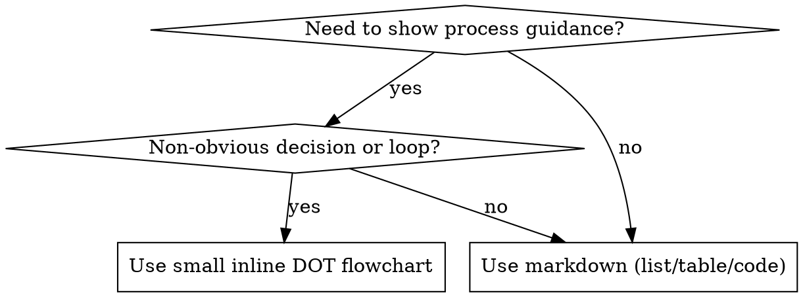

# Optimizing Skills

Use this skill to create, review, or improve SKILL.md-based skills so they trigger correctly, stay concise, and execute reliably.

## When to Use

- Creating a new reusable skill from repeated work patterns.
- Updating an existing skill that under-triggers, over-triggers, or misfires.
- Tightening a skill that is too long, redundant, or hard to execute.
- Converting narrative guidance into concise, imperative instructions.
- Rebalancing where content should live across `SKILL.md`, `references/`, `assets/`, and `scripts/`.

## Overview

### What is a Skill?

A **skill** is a reference guide for proven techniques, patterns, or tools, typically classed as procedural knowledge or best practices.
Skills help future Agent instances find and apply effective approaches.

**Skills are:** Reusable techniques, patterns, tools, reference guides

**Skills are NOT:** Narratives about how you solved a problem once

### When to Create a Skill

**Create when:**

- Technique wasn't intuitively obvious to you or required multiple iterations to get right.
- You'd reference this again across projects / Others would benefit from knowing this.
- Pattern applies broadly (not project-specific)
- Triggerable by specific user intents or common failure modes.

**Don't create for:**

- One-off solutions
- Standard practices well-documented elsewhere
- Project-specific conventions that aren't broadly applicable

## Workflow

### Phase 1: Preparation

1. Choose the path:
   - New skill: initialize scaffold and baseline structure.
   - Existing skill: load current `SKILL.md` and related resources as baseline.
2. Define the target workflow first:
   - List the execution steps in order, including prerequisites, gates, and outputs.
   - Keep steps imperative and executable.
3. Determine trigger scenarios in working notes:
   - Capture 2-3 scenarios that must trigger the skill.
   - Capture up to 2 scenarios that must not trigger the skill.
4. Decide whether a flowchart is required:
   - Use markdown-only workflow when flow is linear and obvious.
   - Add a small DOT flowchart only when branching/loops are non-obvious.

### Phase 2: Draft

1. Draft metadata and usage guidance from preparation:
   - Keep frontmatter to `name` and `description`.
   - Encode trigger scenarios in `description` and `## When to Use` (and `## When Not to Use` when helpful).
2. Draft the skill body in imperative form:
   - Keep instructions short, specific, and ordered by execution.
   - Move deep detail to `references/`, `assets/`, or `scripts/` and link from `SKILL.md`.

### Phase 3: Review and Optimize

1. Run scenario and functional checks against realistic prompts.
2. Review resource fit:
   - Confirm references/assets/scripts are sufficient and scoped.
   - Offload verbose `SKILL.md` sections into resources where appropriate.
3. Optimize the draft:
   - Tighten triggering (under/over-triggering).
   - Remove redundancy and improve progressive disclosure.
   - Re-check whether flowchart usage is still justified.
4. Iterate until trigger behavior and execution quality both pass.

## Core Principles

- Optimize for triggering: description must emphasize when to use the skill (`references/skills-search-optimization.md`).
- Treat trigger scenarios as authoring scaffolding; the final skill should expose triggers through `description` and `## When to Use`.
- Keep frontmatter metadata small (about 100 tokens combined).
- Keep main `SKILL.md` under 500 lines and focused on action.
- Use progressive disclosure: metadata -> SKILL.md -> references/scripts/assets.
- Choose the right degree of freedom: text, pseudocode, or scripts depending on fragility.
- Prefer reusable resources (scripts, templates) over repeated prose.

### Progressive Disclosure Targets

- Metadata (`name` + `description`): small startup footprint, ideally ~100 tokens.
- `SKILL.md`: keep actionable and concise, target \<5000 tokens and \<500 lines.
- `scripts/`, `references/`, `assets/`: loaded only when needed; keep files narrow so agents pull less context.

## Flowchart Guidance



- Use markdown lists/tables/code blocks by default.
- Add DOT only when decision logic or loops are easy to misapply.
- Avoid placeholder node labels; use concrete actions and conditions.
- Follow `references/graphviz-conventions.dot` for node shapes and labels.
- Keep flowcharts small and trigger-based; split large flows into focused subgraphs.

Render DOT to SVG with `scripts/render-dot.py`.
Output SVGs are written to the target skill's `assets/` directory.

```bash
scripts/render-dot.py skills/optimize-skills/references/skill-workflow.dot
scripts/render-dot.py skills/optimize-skills/SKILL.md
scripts/render-dot.py skills/optimize-skills/SKILL.md --force # overwrite existing SVGs
```

## Output

### SKILL.md Structure

```txt
skills/
  skill-name/
    SKILL.md      # Main reference (required)
    assets/       # (optional) Static reusable resources such as templates or figures
    references/   # (optional) On-demand documentation, organized by topic or variant
    scripts/      # (optional) Executable helpers for deterministic tasks;
                  # scripts should be self-contained or clearly declare dependencies,
                  # include clear errors, and handle edge cases.
```

### Rules

- SKILL.md must be named exactly `SKILL.md`.
- Folder name must be kebab-case, matching the `name` in frontmatter.
- Do not add README.md inside the skill.
- YAML frontmatter must include `name` and `description` fields.
- `name` must be kebab-case and match the folder name.
- `description` should emphasize when to use the skill and include triggers/symptoms.
- Avoid workflow summaries in the description.
- Keep descriptions short and specific.
- Prefer `## When to Use` / `## When Not to Use` for trigger cues; do not add a dedicated trigger-scenarios section unless explicitly requested by the repo.
- Refer to `assets/skill-template.md` for a suggested (but easily modified) template structure.

## Common Mistakes

- Summarizing workflow in `description` instead of stating actionable triggers and symptoms.
- Copying working trigger scenarios directly into the final skill instead of converting them into `description` and `## When to Use`.
- Keeping workflows as one giant graph instead of splitting into trigger-based subgraphs.
- Repeating deep reference material in `SKILL.md` instead of linking to `references/`.
- Leaving scripts implicit: deterministic steps should be executable where possible.

## References

- `assets/skill-template.md` for a suggested SKILL.md structure.
- `references/best-practices.md`: checklists, structure guidance, testing, and troubleshooting patterns.
- `references/skills-search-optimization.md`: description and trigger optimization rules.
- `references/skill-workflow.dot`: canonical workflow for this skill.
- `references/graphviz-conventions.dot`: DOT style and semantics for workflow diagrams.
