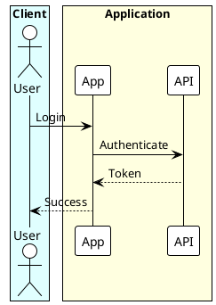

# PlantUML Diagram Generation and Conversion

## Purpose

This skill enables PlantUML diagram creation and conversion. Use for: diagram generation from descriptions, code-to-diagram conversion, .puml file conversion, markdown processing, syntax validation, and Unicode symbol enrichment.

## Intent Classification & Routing Decision Tree

### Step 1: Identify User Intent

**IF** user mentions:
- "create [diagram type]" OR "generate diagram" OR "draw diagram"
  → **Route to**: **Resilient Workflow (PRIMARY)** - `references/workflows/resilient-execution-guide.md`
  → **Script**: `python scripts/resilient_processor.py file.md [--format png]`
  → **Backup Route**: Diagram Creation Workflow (Step 2) if script unavailable

- "convert .puml" OR "convert file" OR ".puml to image"
  → **Route to script**: `python scripts/convert_puml.py file.puml [--format png|svg]`

- "process markdown" OR "extract diagrams" OR "markdown with puml"
  → **Route to script**: `python scripts/process_markdown_puml.py file.md [--format png|svg] [--validate]`

- **"upload to Confluence" OR "upload to Notion"** AND markdown contains PlantUML diagrams
  → **⚠️ CRITICAL**: **Route to script**: `python scripts/process_markdown_puml.py file.md [--format png|svg]` FIRST
  → **Action**: Convert diagrams to images before upload
  → **Reason**: Confluence/Notion do not render PlantUML code blocks natively

- "from code" OR "analyze [Spring Boot|FastAPI|ETL|Node.js|React]"
  → **Route to**: `examples/[framework]/`

- "syntax error" OR "fix diagram" OR "error message" OR "not working"
  → **Route to**: `references/troubleshooting/toc.md`

- "style" OR "theme" OR "colors" OR "appearance"
  → **Route to**: `references/styling_guide.md`

- "symbols" OR "icons" OR "emojis" OR "unicode"
  → **Route to**: `references/unicode_symbols.md`

### Step 2: Classify Diagram Type (if creating new diagram)

**IF** user describes:
- **Interactions/messages over time**: "API call", "message", "participant", "sequence"
  → Load `references/sequence_diagrams.md`

- **Class structure**: "class", "inheritance", "OOP", "extends", "implements"
  → Load `references/class_diagrams.md`

- **Database schema**: "database", "entity", "table", "schema", "ER diagram"
  → Load `references/er_diagrams.md`

- **Workflow/process**: "workflow", "process", "activity", "decision", "fork/join"
  → Load `references/activity_diagrams.md`

- **State machine**: "state", "transition", "state machine"
  → Load `references/state_diagrams.md`

- **Project timeline**: "gantt", "timeline", "schedule", "milestones"
  → Load `references/gantt_diagrams.md`

- **System architecture**: "component", "module", "architecture"
  → Load `references/component_diagrams.md`

- **Deployment**: "deployment", "server", "infrastructure", "cloud"
  → Load `references/deployment_diagrams.md`

- **Use cases**: "actor", "use case", "features"
  → Load `references/use_case_diagrams.md`

- **Ideas/brainstorm**: "mindmap", "brainstorm", "ideas"
  → Load `references/mindmap_diagrams.md`

**IF** diagram type unclear:
→ Load `references/toc.md` (156 lines, ~780 tokens)
→ Present options to user
→ Route to selected workflow

### Step 3: Load Supporting Resources (On-Demand Only)

**Load only when explicitly needed:**

- **Syntax reference**: Load `references/[diagram_type]_diagrams.md` ONLY IF:
  - First-time creation for user
  - Complex/advanced features needed
  - User requests "how to" or "syntax"
  - Cost: 1,500-3,000 tokens

- **Styling**: Load `references/styling_guide.md` ONLY IF:
  - User mentions "style", "color", "theme"
  - Workflow reaches styling step
  - Cost: ~1,000 tokens

- **Unicode symbols**: Load `references/unicode_symbols.md` ONLY IF:
  - User building code-to-diagram
  - User mentions "symbols" or "icons"
  - Cost: ~1,250 tokens

- **Examples**: Load `examples/[framework]/` ONLY IF:
  - User explicitly requests examples
  - Workflow references specific example
  - Cost: ~750 tokens

- **Troubleshooting**: Load troubleshooting guides ONLY IF:
  - Error occurs during generation
  - User reports syntax issue
  - **Start with**: `references/troubleshooting/toc.md` (~400 tokens) - Error decision tree
  - **Then load specific guide**: `references/troubleshooting/[category]_guide.md` (~500-1,000 tokens)
  - 12 focused guides covering 215+ common errors
  - Cost: ~400-1,400 tokens total (decision tree + specific guide)

## Token Budget Management

### Budget Limits
- **Tier 1** (metadata): 100 tokens (loaded)
- **Tier 2** (this file): ~2,000 tokens (loaded)
- **Tier 3** (per workflow): 1,000-2,000 tokens (load on-demand)
- **Target total**: <10,000 tokens per typical request
- **Maximum**: <15,000 tokens for complex requests

### Loading Cost Estimates

| Resource Type | File Pattern | Token Cost | Load When |
|--------------|--------------|------------|-----------|
| Workflow guide | `references/[type]_diagrams.md` | ~1,500 | Intent identified |
| Syntax reference | `references/[type]_diagrams.md` | 1,500-3,000 | Complex features needed |
| Styling guide | `references/styling_guide.md` | ~1,000 | User requests styling |
| Examples | `examples/[framework]/` | ~750 | User requests examples |
| Troubleshooting (TOC) | `references/troubleshooting/toc.md` | ~400 | Error decision tree |
| Troubleshooting (guide) | `references/troubleshooting/[category]_guide.md` | ~500-1,000 | Specific error type |
| Unicode symbols | `references/unicode_symbols.md` | ~1,250 | Code-to-diagram workflow |
| Code examples | `examples/[framework]/` | ~500 | Framework analysis |

### Budget Scenarios

**Simple Request** (user familiar with syntax):
- Tier 1 + Tier 2 + Workflow: 100 + 2,000 + 1,500 = **3,600 tokens** ✅

**Standard Request** (need syntax reference):
- Tier 1 + Tier 2 + Workflow + Syntax: 100 + 2,000 + 1,500 + 2,500 = **6,100 tokens** ✅

**Complex Request** (syntax + styling + examples):
- Tier 1 + Tier 2 + Workflow + Syntax + Styling + Examples: 100 + 2,000 + 1,500 + 2,500 + 1,000 + 750 = **7,850 tokens** ✅

**Advanced Request** (all resources):
- Tier 1 + Tier 2 + Multiple workflows + Resources: **~10,000-15,000 tokens** ⚠️

### Budget-Conscious Strategies

1. **Skip syntax reference** if user provides clear diagram description
2. **Use inline minimal examples** instead of loading full example guides
3. **Load basic styling** instead of comprehensive guide
4. **Reference examples directory** without loading guide files
5. **Load only relevant section** of troubleshooting guide (navigate to specific diagram type)

## Resource Loading Policy

### MANDATORY LOADING RULES

**1. Workflow Guides**
- **When**: User intent classified
- **Path**: `references/[type]_diagrams.md`
- **Cost**: ~1,500 tokens
- **Rule**: Load ONLY the relevant diagram reference, NEVER all references

**2. Syntax References**
- **When**: First-time creation OR complex features OR user requests
- **Path**: `references/[diagram_type]_diagrams.md`
- **Cost**: 1,500-3,000 tokens
- **Rule**: SKIP for simple diagrams with clear user description

**3. Styling Resources**
- **When**: User mentions styling OR workflow reaches styling step
- **Path**: `references/styling_guide.md`
- **Cost**: ~1,000 tokens
- **Rule**: NEVER preload, only on explicit need

**4. Examples**
- **When**: User requests examples OR workflow explicitly references
- **Path**: `examples/[framework]/`
- **Cost**: ~750 tokens
- **Rule**: NEVER preload "just in case"

**5. Code-to-Diagram Patterns**
- **When**: User has codebase OR mentions framework
- **Path**: `examples/[framework]/`
- **Cost**: ~500 per example
- **Rule**: Load only the matching framework examples

**6. Troubleshooting**
- **When**: Error occurs OR user reports issue
- **Path**: `references/troubleshooting/toc.md` → `references/troubleshooting/[category]_guide.md`
- **Cost**: ~500-1,000 tokens
- **Rule**: Load only when problem identified

**7. Unicode Symbols**
- **When**: Code-to-diagram OR user mentions symbols
- **Path**: `references/unicode_symbols.md`
- **Cost**: ~1,250 tokens
- **Rule**: Load only relevant category section

### How to Load Resources

**Use Read tool with specific file path:**
```
Read tool: [skill-root]/[path]
```

**NEVER:**
- Use Glob to load entire directories
- Load "just in case" resources
- Preload comprehensive guides when focused guide suffices
- Load multiple diagram type guides simultaneously

## Setup Verification

Before creating diagrams, verify setup:

```
python scripts/check_setup.py
```

Checks: Java, Graphviz, plantuml.jar

**If missing components** → Load `references/plantuml_reference.md` (Installation section)

## Core Workflows (Routing Only)

### 1. Diagram Creation
**Trigger**: User requests new diagram
**Route**: Classify type → Load `references/[type]_diagrams.md`
**Supporting**: Syntax reference (if needed), styling (if requested)

### 2. Standalone Conversion
**Trigger**: Convert .puml file(s) to images
**Route**: Direct script command
**Script**: `python scripts/convert_puml.py file.puml [--format png|svg]`

### 3. Markdown Processing
**Trigger**: Markdown with PlantUML blocks or linked .puml files
**⚠️ CRITICAL Trigger**: User uploading markdown to Confluence or Notion with PlantUML diagrams
**Route**: Direct script command
**Script**: `python scripts/process_markdown_puml.py file.md [--format png]`
**Output**: `file_with_images.md` + `images/` directory
**Note**: Confluence/Notion require diagram conversion to images before upload

### 4. Code-to-Diagram
**Trigger**: Analyze codebase and generate diagrams
**Route**: `examples/[framework]/`
**Supporting**: Framework examples from `examples/[framework]/`

### 5. Troubleshooting
**Trigger**: Syntax error or generation failure
**Route**:
  1. Load `references/troubleshooting/toc.md` - Error decision tree
  2. Identify error category
  3. Load specific guide: `references/troubleshooting/[category]_guide.md`
**Resources**: 12 guides covering 215+ common errors (installation, syntax, arrows, styling, diagrams, performance)

### 6. Styling
**Trigger**: User wants to customize appearance
**Route**: `references/styling_guide.md`
**Supporting**: `references/styling_guide.md`

**Default Visual Policy (sequence-first readability):**
1. Use `!theme plain` as neutral baseline
2. For sequence diagrams, group participants by architecture layer using `box "..." #Color`
3. Use soft background colors for layer boxes; keep participant/arrow styling mostly default
4. Add `<style>` only for focused readability improvements, not full recoloring

### 7. Resilient Workflow (PRIMARY)
**Trigger**: ALL diagram creation requests (recommended default)
**Route**: `references/workflows/resilient-execution-guide.md`
**Script**: `python scripts/resilient_processor.py file.md [--format png|svg]`
**Steps**:
  1. Identify type → Load reference
  2. Create file → Structured naming: `./diagrams/<md>_<num>_<type>_<title>.puml`
  3. Convert → Handle errors with troubleshooting guides (max 3 retries)
  4. Validate → Integrate into markdown
**Error Fallback**: Perplexity → Brave Search → Gemini → WebSearch
**Benefits**:
  - Consistent file naming for organization
  - Automatic error recovery with troubleshooting guides
  - External search fallback for unresolved errors
  - Validation before markdown integration

## Quick Reference (Minimal)

**Universal Structure:**


**Common Arrows**: `->` solid, `-->` dashed, `..>` dotted

**Scripts:**
- **Resilient (PRIMARY)**: `python scripts/resilient_processor.py file.md [--format png]`
- Convert: `python scripts/convert_puml.py file.puml [--format svg]`
- Markdown: `python scripts/process_markdown_puml.py doc.md [--validate]`
- Setup check: `python scripts/check_setup.py`

**For detailed syntax** → Load `references/[type]_diagrams.md`

**Sequence baseline with grouped layers (recommended):**


## Error Handling

### Missing plantuml.jar
1. Check: `python scripts/check_setup.py`
2. Load: `references/plantuml_reference.md` (Installation section)

### Syntax Error
1. Load: `references/troubleshooting/toc.md` (~400 tokens)
2. Use error decision tree to identify category
3. Load specific guide: `references/troubleshooting/[category]_guide.md` (~500-1,000 tokens)
4. Apply recommended fix from guide

**Comprehensive troubleshooting coverage (215+ errors in 12 guides):**
- **Setup**: Installation, Java, Graphviz, plantuml.jar (15 errors)
- **Syntax**: Delimiters, comments, basic structure (20 errors)
- **Arrows**: Relationship syntax across all diagram types (20 errors)
- **Text**: Quotes, special characters, encoding (20 errors)
- **Styling**: skinparam, style blocks, colors, fonts (20 errors) — If `skinparam` errors appear, migrate to modern `<style>` blocks.
- **Preprocessor**: !include, !define, !procedure (20 errors)
- **Sequence diagrams**: Participants, arrows, fragments (20 errors)
- **Class diagrams**: Relationships, visibility, generics (20 errors)
- **ER diagrams**: Entities, cardinality, keys (20 errors)
- **Activity diagrams**: Flow control, forks, partitions (20 errors)
- **Image generation**: Rendering, output formats (20 errors)
- **Performance**: Timeouts, memory, optimization (20 errors)

### Unknown Diagram Type
1. Load: `references/toc.md` (~780 tokens)
2. Present options
3. Route to selected workflow

### Setup Issues
1. Load: `references/plantuml_reference.md` (Installation section)
2. Follow setup instructions

## Skill Integration Points

**Invoke other skills when:**
- Complex code analysis → Use `general-purpose` agent
- Documentation generation → Use `docs-sync-editor` after diagram creation
- Grammar in labels → Use `grammar-style-editor`
- Architecture analysis → Use `code-explainer` before code-to-diagram

## Diagram Type Classification Keywords

**Quick routing keywords:**

- **Sequence**: "interaction", "API call", "message flow", "participant"
- **Class**: "class diagram", "inheritance", "OOP", "extends"
- **ER**: "database", "entity", "schema", "table", "relation"
- **Activity**: "workflow", "process", "decision", "activity"
- **State**: "state machine", "transition", "state"
- **Component**: "component", "module", "architecture"
- **Deployment**: "deployment", "infrastructure", "server"
- **Gantt**: "timeline", "schedule", "project", "gantt"
- **Use Case**: "actor", "use case", "features"
- **MindMap**: "mindmap", "brainstorm", "ideas"

**For all 19 types** → Load `references/toc.md`

## Token Budget Tracking

**Current session tracking:**
- Report when approaching 10,000 tokens
- Suggest lighter alternatives if budget tight
- Document loaded resources

**Budget escalation thresholds:**
- <5,000 tokens: Excellent ✅
- 5,000-10,000 tokens: Normal ✅
- 10,000-15,000 tokens: Review necessity ⚠️
- >15,000 tokens: Minimize loading ❌

## References (Load On-Demand)

**Core Syntax** (load when needed):
- `references/toc.md` - All diagram types navigation
- `references/[type]_diagrams.md` - Specific diagram syntax
- `references/common_format.md` - Universal elements
- `references/styling_guide.md` - CSS-like styling
- `references/plantuml_reference.md` - CLI and troubleshooting

**Troubleshooting Resources** (⚠️ load when errors occur):
- `references/troubleshooting/toc.md` - Error decision tree and navigation hub
- `references/troubleshooting/*.md` - 12 focused guides (215+ common errors)
  - Installation, syntax, arrows, text, styling, preprocessor
  - Sequence, class, ER, activity diagrams
  - Image generation, performance

**Other Resources** (load when needed):
- `references/common_syntax_errors.md` - Legacy comprehensive guide
- `references/unicode_symbols.md` - Symbol enrichment
- `examples/[framework]/` - Code-to-diagram patterns

## Summary: Using This Skill Effectively

**Decision Tree Process:**
1. **Classify intent** using Step 1 routing
2. **Load diagram references or run target script** for identified task
3. **Load supporting resources** only as workflow requires
4. **Track token budget** throughout process
5. **Use Read tool** for surgical loading

**Never:**
- Load entire directories
- Preload "just in case"
- Load all diagram type guides
- Exceed budget without necessity

**This PDA architecture:**
- Reduces typical requests: 24-40% fewer tokens
- Reduces complex requests: 60-70% fewer tokens
- Loads only relevant content
- Maintains quality and completeness
