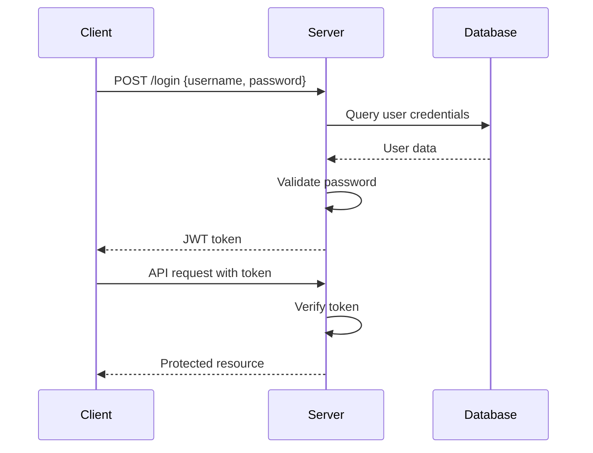
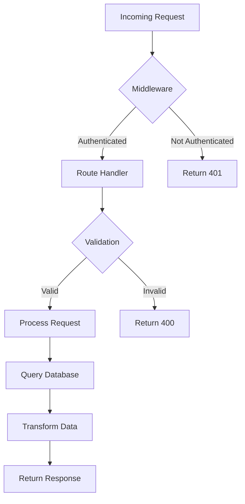
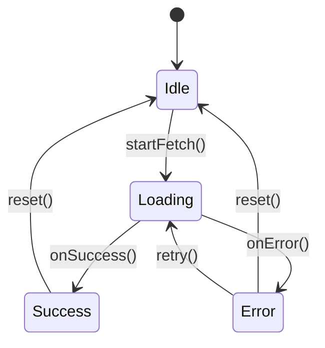

# Tech Docs Research

Systematic workflow for researching technical documentation using Firecrawl's mapping and scraping capabilities.

## Workflow

Follow this 5-step process for comprehensive documentation research:

### Step 1: Create Research Directory

Create a timestamped directory for this research session:

```bash
# Generate timestamp and topic-based folder name
TIMESTAMP=$(date +"%Y_%m_%d_%H_%M_%S")
TOPIC="react-hooks"  # Replace with sanitized topic name (lowercase, hyphens instead of spaces)
RESEARCH_DIR=".firecrawl/${TIMESTAMP}_${TOPIC}"

# Create the research directory structure
mkdir -p "$RESEARCH_DIR/pages"

echo "Research directory: $RESEARCH_DIR"
```

**Folder naming rules:**
- Format: `YYYY_MM_DD_HH_mm_ss_<topic>`
- Topic should be lowercase, use hyphens for spaces
- Examples: `2026_02_08_14_30_45_react-hooks`, `2026_02_08_15_20_10_nextjs-routing`

### Step 2: Identify Documentation Base URL

Ask the user for the base documentation URL if not provided, or infer from the technology name:

```bash
# Examples:
# React: https://react.dev
# Next.js: https://nextjs.org/docs
# Python: https://docs.python.org
# FastAPI: https://fastapi.tiangolo.com
```

### Step 3: Map Documentation Structure

Use `firecrawl map` to discover all documentation URLs, filtering by the user's topic:

```bash
# Basic mapping with search filter
firecrawl map https://docs.example.com --search "authentication" -o "$RESEARCH_DIR/docs-urls.txt"

# For comprehensive research (more URLs)
firecrawl map https://docs.example.com --search "api" --limit 100 -o "$RESEARCH_DIR/docs-urls.json" --json

# Include subdomains if documentation spans multiple domains
firecrawl map https://example.com --include-subdomains --search "guides" -o "$RESEARCH_DIR/all-docs.txt"
```

**Key points:**
- Use `--search` to filter URLs by topic keywords
- Output as JSON (`--json`) for easier processing
- Adjust `--limit` based on scope (default: all URLs found)
- Review the mapped URLs before scraping to ensure relevance

### Step 4: Scrape Documentation in Parallel

Extract URLs from the map output and scrape them in parallel:

```bash
# Check concurrency limit first
firecrawl --status

# Extract URLs from JSON and scrape in parallel (example for 5 URLs)
jq -r '.urls[]' "$RESEARCH_DIR/docs-urls.json" | head -5 | while read url; do
  filename=$(echo "$url" | sed 's|https://||' | sed 's|/|_|g')
  firecrawl scrape "$url" --only-main-content -o "$RESEARCH_DIR/pages/${filename}.md" &
done
wait

# Or use xargs for better parallel control (adjust -P based on concurrency limit)
jq -r '.urls[]' "$RESEARCH_DIR/docs-urls.json" | head -10 | \
  xargs -P 10 -I {} sh -c 'firecrawl scrape "{}" --only-main-content -o "'"$RESEARCH_DIR"'/pages/$(echo {} | md5sum | cut -d\" \" -f1).md"'
```

**Best practices:**
- Always check `firecrawl --status` for concurrency limits
- Use `--only-main-content` to remove navigation and boilerplate
- Organize scraped pages in `$RESEARCH_DIR/pages/` subdirectory
- Use meaningful filenames or hash-based names for URLs
- Scrape incrementally for large documentation sets (10-20 pages at a time)

### Step 5: Analyze and Summarize

Read the scraped documentation incrementally and generate a structured summary:

```bash
# Check what was scraped
ls -lh "$RESEARCH_DIR/pages/"

# Preview first file to understand structure
head -50 "$RESEARCH_DIR/pages/"[first-file].md

# Use grep to find specific information across all files
grep -r "example" "$RESEARCH_DIR/pages/" | head -20
grep -r "configuration" "$RESEARCH_DIR/pages/" -A 5
```

**Summary structure:**

Generate a summary following this template:

**IMPORTANT:**
- **Save to both locations**:
  - Save the final summary to `$RESEARCH_DIR/summary.md` (for archival)
  - Also save to `docs/` directory for easy access (e.g., `docs/react-hooks-research.md`)
- **Include source URLs**: Every finding, code example, and key point MUST include the source documentation URL for traceability and reference
- **Preserve research directory**: The `$RESEARCH_DIR` folder contains all raw scraped pages, URLs, and the summary for future reference
- **Use Mermaid diagrams**: When documenting processes, workflows, or relationships, use Mermaid diagrams (flowcharts, sequence diagrams, etc.) to make complex concepts visual and easier to understand

```markdown
# [Technology/Topic] Documentation Research

**Date**: [YYYY-MM-DD]
**Research Scope**: [Brief description of what was researched]
**Pages Analyzed**: [Number of documentation pages]

## Overview
[Brief description of what was researched and total pages analyzed]

## Key Findings

### [Topic Area 1]
- **Main concept**: [explanation]
- **Key points**:
  - [point 1] ([Source URL])
  - [point 2] ([Source URL])
- **Code example**:
  ```[language]
  [code snippet]
  ```
  > Source: [URL to documentation page]

### [Topic Area 2]
- **Summary**: [explanation] ([Source URL])
- **Details**:
  - [finding with source link]
  - [finding with source link]

## Process Flow (Use Mermaid diagrams when applicable)

### Authentication Flow Example

> Source: [URL to authentication documentation]

### Request Lifecycle Example

> Source: [URL to request handling documentation]

### State Machine Example

> Source: [URL to state management documentation]

**When to use Mermaid diagrams:**
- **Sequence Diagrams**: API calls, authentication flows, multi-step processes, component interactions
- **Flowcharts**: Decision trees, request lifecycle, data processing pipelines, workflow logic
- **State Diagrams**: Component states, application lifecycle, form validation states
- **Class/ER Diagrams**: Data models, database schemas, type relationships
- **Gantt Charts**: Migration timelines, deprecation schedules

## Common Patterns
[Recurring themes, best practices, or conventions found across documentation]
- Pattern 1 - [Description] ([Source URLs])
- Pattern 2 - [Description] ([Source URLs])

## Important Notes
[Warnings, deprecations, or critical information highlighted in the docs]
- **Warning**: [description] - See: [URL]
- **Deprecation**: [description] - See: [URL]

## Documentation Resources
- [Page Title 1](URL) - [Brief description]
- [Page Title 2](URL) - [Brief description]
- [API Reference](URL)
- [Tutorial/Guide](URL)

## Next Steps
[Suggested actions based on findings]

---
**Output saved to**:
- Research archive: `$RESEARCH_DIR/summary.md`
- Quick access: `docs/[filename].md`
**Research conducted using**: Firecrawl mapping and scraping
```

**Saving the summary:**

```bash
# Save summary to both locations
cat > "$RESEARCH_DIR/summary.md" << 'EOF'
[Your generated summary content here]
EOF

# Copy to docs/ for easy access
cp "$RESEARCH_DIR/summary.md" "docs/${TOPIC}-research.md"

echo "Research completed!"
echo "Archive: $RESEARCH_DIR"
echo "Summary: docs/${TOPIC}-research.md"
```

**Reading strategy:**
- Don't load entire files at once—use `head`, `grep`, or incremental reads
- Focus on sections relevant to the user's question
- Extract code examples, configuration patterns, and API signatures
- Cross-reference information across multiple pages
- Identify process flows and workflows that would benefit from visual diagrams

**Visualization best practices:**
- Use Mermaid diagrams to illustrate complex processes, flows, and relationships
- Always include source URLs for each diagram to trace back to the documentation
- Common diagram types:
  - `sequenceDiagram`: API interactions, authentication flows, multi-service communication
  - `flowchart`: Decision logic, request handling, data pipelines
  - `stateDiagram-v2`: Component lifecycle, application states, form flows
  - `classDiagram`: Type hierarchies, data models, interface relationships
  - `erDiagram`: Database schemas, entity relationships
  - `gantt`: Project timelines, migration schedules, deprecation roadmaps

**Directory structure after completion:**

```
.firecrawl/
└── 2026_02_08_14_30_45_react-hooks/
    ├── docs-urls.json          # Mapped URLs
    ├── pages/                  # Scraped documentation
    │   ├── page1.md
    │   ├── page2.md
    │   └── ...
    └── summary.md              # Research summary

docs/
└── react-hooks-research.md     # Copy for quick access
```

## Advanced Patterns

### Multi-Site Research

Research across multiple documentation sources:

```bash
# Create research directory for multi-site research
TIMESTAMP=$(date +"%Y_%m_%d_%H_%M_%S")
TOPIC="react-nextjs-comparison"
RESEARCH_DIR=".firecrawl/${TIMESTAMP}_${TOPIC}"
mkdir -p "$RESEARCH_DIR/pages"

# Map multiple sites
firecrawl map https://docs.react.dev --search "hooks" -o "$RESEARCH_DIR/react-urls.json" --json &
firecrawl map https://nextjs.org/docs --search "routing" -o "$RESEARCH_DIR/nextjs-urls.json" --json &
wait

# Combine and scrape
cat "$RESEARCH_DIR/react-urls.json" "$RESEARCH_DIR/nextjs-urls.json" | \
  jq -r '.urls[]' | \
  xargs -P 10 -I {} sh -c 'firecrawl scrape "{}" --only-main-content -o "'"$RESEARCH_DIR"'/pages/$(echo {} | md5sum | cut -d\" \" -f1).md"'
```

### Topic-Focused Deep Dive

When researching a specific API or feature:

```bash
# 1. Create research directory
TIMESTAMP=$(date +"%Y_%m_%d_%H_%M_%S")
TOPIC="useeffect-deep-dive"
RESEARCH_DIR=".firecrawl/${TIMESTAMP}_${TOPIC}"
mkdir -p "$RESEARCH_DIR/pages"

# 2. Search for the exact topic
firecrawl map https://docs.example.com --search "useEffect hook" -o "$RESEARCH_DIR/topic-urls.json" --json

# 3. Scrape with additional context (include related sections)
jq -r '.urls[]' "$RESEARCH_DIR/topic-urls.json" | \
  xargs -P 5 -I {} firecrawl scrape "{}" -o "$RESEARCH_DIR/pages/$(basename {}).md"

# 4. Extract all code examples
grep -r "```" "$RESEARCH_DIR/pages/" -A 10 > "$RESEARCH_DIR/code-examples.txt"
```

### Version-Specific Research

Compare documentation across versions:

```bash
# Create research directory
TIMESTAMP=$(date +"%Y_%m_%d_%H_%M_%S")
TOPIC="framework-v4-to-v5-migration"
RESEARCH_DIR=".firecrawl/${TIMESTAMP}_${TOPIC}"
mkdir -p "$RESEARCH_DIR/pages/v4" "$RESEARCH_DIR/pages/v5"

# Map different versions
firecrawl map https://v4.docs.example.com --search "migration" -o "$RESEARCH_DIR/v4-urls.json" --json
firecrawl map https://v5.docs.example.com --search "migration" -o "$RESEARCH_DIR/v5-urls.json" --json

# Scrape into version-specific directories
jq -r '.urls[]' "$RESEARCH_DIR/v4-urls.json" | \
  xargs -P 5 -I {} sh -c 'firecrawl scrape "{}" -o "'"$RESEARCH_DIR"'/pages/v4/$(echo {} | md5sum | cut -d\" \" -f1).md"'
jq -r '.urls[]' "$RESEARCH_DIR/v5-urls.json" | \
  xargs -P 5 -I {} sh -c 'firecrawl scrape "{}" -o "'"$RESEARCH_DIR"'/pages/v5/$(echo {} | md5sum | cut -d\" \" -f1).md"'
```

## Tips

1. **Start narrow, expand if needed**: Begin with specific search terms, then broaden if results are insufficient
2. **Check file sizes**: Use `wc -l` and `ls -lh` to gauge content volume before reading
3. **Use grep effectively**: Search for specific terms, function names, or error codes across all scraped files
4. **Respect rate limits**: Monitor concurrency with `firecrawl --status` and adjust parallel operations
5. **Organized archives**: Each research session creates a timestamped directory in `.firecrawl/` for complete traceability
6. **Dual saving**: Save summaries to both `$RESEARCH_DIR/summary.md` (archive) and `docs/` (quick access)
7. **Review past research**: Browse `.firecrawl/` to find previous research sessions by timestamp and topic name

## Common Use Cases

- **API Integration**: Research authentication, endpoints, rate limits, and SDKs
- **Migration Planning**: Gather breaking changes, deprecations, and migration guides
- **Feature Implementation**: Find usage patterns, configuration options, and examples
- **Troubleshooting**: Search error codes, known issues, and solutions in official docs
- **Best Practices**: Extract recommended patterns, performance tips, and security guidelines
