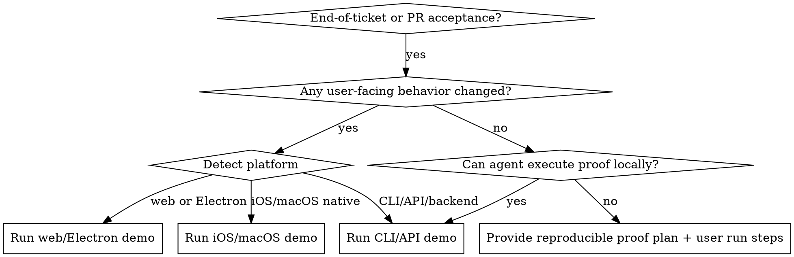

# Running User Acceptance Walkthroughs

## Overview

Acceptance at delivery time should be experiential, not just a test summary.
Primary goal: help the human directly see and feel what changed before merge.
If work is not user-facing, run and show executable proof with user-impact translation.
For user-facing work, **launch the actual app and use the feature as a real user would** — navigating screens, clicking buttons, filling forms, observing results.
Then give the user instructions for running it themselves.

## Demo means "use the app", not "run tests"

Running e2e tests is not a demo. Tests verify code correctness. A demo lets the user see the feature working in the real app, interactively, so they can judge whether the right thing was built.

For user-facing work, the sequence is always:
1. **Start the app** (dev server, simulator, Electron launch)
2. **Navigate to the feature** in the running app
3. **Use it** — click, type, scroll, interact as a user would
4. **Show the result** — screenshot or describe what appeared on screen

Only after the live demo, run tests if needed to confirm no regressions. Tests supplement the demo; they do not replace it.

## When to Use

- End of PR/ticket prompts: "UAT", "verify", "walk me through", "show what changed", "can we merge?"
- Sign-off requests where confidence requires direct observation, not only CI output
- Mixed work (UI + backend/infrastructure) that needs both walkthrough and proof

Do not use for mid-implementation debugging or code-quality review without acceptance intent.

## Decision Flow

## Step-by-Step Workflow

### 1. Identify scope, mode, and platform

- Confirm what behavior is being accepted.
- Declare `Mode`: `user-facing`, `non-user-facing`, or `mixed`.
- For user-facing work, detect `Platform` to select the right demo tool:

| Signal | Platform | Playbook |
| --- | --- | --- |
| Xcode project, `.xcodeproj`, `.swift` files, iOS simulator | iOS/macOS native | `./references/ios-demo-playbook.md` |
| Web app, `package.json` with dev server, browser-based UI | Web | `./references/web-demo-playbook.md` |
| Electron app, `electron` in dependencies | Electron | `./references/web-demo-playbook.md` (Electron section) |
| CLI tool, API endpoint, backend service, infrastructure | CLI/API | `./references/cli-api-demo-playbook.md` |

If the platform is ambiguous, ask the user.

### 2. Define acceptance slices

Break validation into small slices (2-5), each with clear pass/fail criteria.

How to derive slices:
- Start from the ticket's acceptance criteria if they exist
- Otherwise, map each user-visible behavior change to a slice
- For non-user-facing work, map each functional change to a demonstrable proof
- Each slice should be independently verifiable — avoid slices that only pass if run in sequence

### 3. Execute validation

Follow the appropriate playbook:

- **User-facing (web/Electron):** `./references/web-demo-playbook.md`
- **User-facing (iOS/macOS):** `./references/ios-demo-playbook.md`
- **Non-user-facing or CLI/API:** `./references/cli-api-demo-playbook.md`
- **Mixed:** run user-facing demo first, then technical proof tied to the same outcome.

### 4. Capture evidence

- Save screenshots/video for user-facing slices.
- Save exact commands and key output lines for technical slices.

### 5. Report results to the user

- Start with overview and scope bullets.
- List each slice with explicit `Pass`/`Fail`.
- Provide instructions to the user for running the same validation themselves.
- End with `Recommendation`: `GO`, `GO with follow-ups`, or `NO-GO`.

### 6. Update ticket (required on success)

If recommendation is `GO` or `GO with follow-ups`, post a ticket comment in the project system of record (check CLAUDE.md or project config; common systems: Linear, Jira, GitHub Issues) with:

1. UAT verdict (`GO` / `GO with follow-ups`)
2. Scope validated (2-5 bullets)
3. Mode and platform used
4. Slice-by-slice pass/fail summary
5. Evidence links or file paths (screenshots, videos, logs)
6. Commands run (for non-user-facing or mixed technical slices)
7. Any follow-ups or residual risks

If no ticket is known, ask for the ticket ID before closing UAT.
Do not mark acceptance complete until this ticket update is posted.

## Quick Reference

| Mode            | First step                                 | Evidence required                            | Done when                                 |
| --------------- | ------------------------------------------ | -------------------------------------------- | ----------------------------------------- |
| user-facing     | Run platform-appropriate demo (slice 1)    | Demo trace + screenshots/video + observed UI | User confirms pass/fail for all scenarios |
| non-user-facing | Run proof command(s)                       | Command output + impact translation          | Reproducible evidence reviewed            |
| mixed           | User-facing demo first, then technical proof | Both demo evidence and technical proof       | Both layers accepted                      |

## Common Mistakes

- Running e2e or UI tests instead of launching the app and using the feature
- Dumping a static checklist with no interaction
- Reporting only test counts with no demonstration
- Skipping a live demo for user-facing changes
- Skipping non-UI demo because there is no frontend change
- Declaring merge readiness before collecting explicit pass/fail signals
- Using the wrong demo tool for the platform (e.g., agent-browser for an iOS app)

## Rationalization Table

| Excuse                                             | Reality                                                                          |
| -------------------------------------------------- | -------------------------------------------------------------------------------- |
| "No UI changes, so UAT is just unit tests."        | Non-user-facing work still needs demonstrable proof and user-impact explanation. |
| "We are in a rush, give a fast merge checklist."   | Time pressure increases need for clear GO/NO-GO evidence.                        |
| "I already summarized everything; that is enough." | Summaries do not replace user experience or executable demonstration.            |
| "User can test later after merge."                 | Acceptance belongs before merge unless explicitly deferred by user.              |
| "Tests pass, so it works."                         | Tests prove code correctness. Acceptance proves the right thing was built.       |
| "I'll run the e2e test suite as the demo."         | E2e tests are automated assertions. A demo is using the app interactively.      |

## Red Flags - Stop and Correct

- You are about to run a test suite instead of launching the app and using the feature.
- You are about to send only a summary/checklist.
- You cannot point to any observed behavior or executed proof.
- You are treating CI green status as equivalent to acceptance.
- You are asking for merge without an explicit acceptance signal.
- You skipped platform detection and defaulted to the wrong demo tool.
