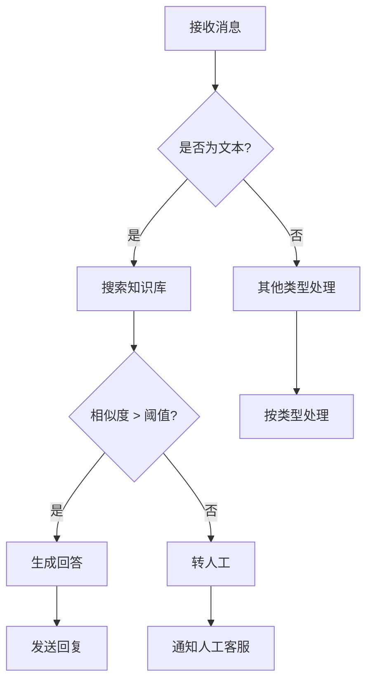

# 企业微信客服自动化系统

这是一个完整的企业微信客服 AI 助手解决方案，能够自动处理好友添加、智能问答、人工转接等场景。

## 核心功能

### 1. 自动同意好友添加
- 实时监听好友添加事件
- 自动通过好友请求
- 发送欢迎消息
- 标注用户来源和标签

### 2. 基于知识库的智能问答
- 向量知识库存储企业知识
- 语义搜索匹配问题
- LLM 生成专业回复
- 支持多轮对话上下文

### 3. 未知问题人工介入
- 置信度阈值判断
- 自动提醒人工客服
- 转接对话给人工
- 记录未解决问题用于优化

## 技术架构

```
┌─────────────┐
│ 企业微信     │
│  Webhook    │
└──────┬──────┘
       │
       ▼
┌─────────────────┐
│  回调服务器      │
│  (Go/Python)    │
└──────┬──────────┘
       │
       ├──────────────────┐
       │                  │
       ▼                  ▼
┌──────────────┐   ┌──────────────┐
│ 向量知识库    │   │  LLM API     │
│ (PG+pgvector)│   │ (Kimi/GPT-4) │
└──────────────┘   └──────────────┘
       │
       ▼
┌──────────────┐
│  人工提醒     │
│  (Telegram)  │
└──────────────┘
```

## 快速开始

### 第一步：配置企业微信应用

1. **创建企业微信应用**
   - 登录企业微信管理后台
   - 应用管理 → 创建应用 → 选择"微信客服"
   - 记录以下信息：
     - `corp_id`: 企业 ID
     - `agent_id`: 应用 AgentId
     - `secret`: 应用 Secret

2. **配置回调地址**
   ```
   URL: https://your-domain.com/wecom/callback
   Token: 自定义验证令牌
   EncodingAESKey: 自动生成
   ```

3. **订阅所需事件**
   - 联系人变更事件
   - 消息事件
   - 外部联系人免验证添加事件

### 第二步：设置知识库

```bash
# 1. 安装 PostgreSQL + pgvector
sudo apt install postgresql-14
sudo -u postgres psql -c "CREATE EXTENSION vector;"

# 2. 创建数据库
sudo -u postgres createdb wecom_kb

# 3. 初始化表结构
psql wecom_kb < ~/clawd/skills/wecom-cs-automation/schema.sql
```

### 第三步：导入知识库数据

```bash
# 1. 准备知识文档（Markdown 格式）
# 2. 切片并向量化
python3 ~/clawd/skills/wecom-cs-automation/scripts/import_kb.py \
  --input knowledge.md \
  --token $(pass show api/kimi)

# 3. 验证导入
psql wecom_kb -c "SELECT COUNT(*) FROM knowledge_chunks;"
```

### 第四步：启动回调服务

```bash
# 1. 配置环境变量
cat > .env << EOF
WECOM_CORP_ID=$(pass show api/wecom-corp-id)
WECOM_AGENT_SECRET=$(pass show api/wecom-agent-secret)
WECOM_TOKEN=your_webhook_token
WECOM_AES_KEY=your_aes_key
KB_DB_URL=postgresql://localhost/wecom_kb
LLM_API_KEY=$(pass show api/kimi)
LLM_API_BASE=https://api.moonshot.cn/v1
NOTIFICATION_CHANNEL=telegram:8518085684
EOF

# 2. 启动服务（Python FastAPI）
uvicorn wecom_callback_server:app --host 0.0.0.0 --port 8000

# 或使用 Go
go run cmd/server/main.go
```

### 第五步：验证服务

```bash
# 1. 检查服务状态
curl http://localhost:8000/health

# 2. 测试知识库搜索
curl -X POST http://localhost:8000/api/test_kb \
  -H "Content-Type: application/json" \
  -d '{"query": "如何退款？"}'
```

## 使用方法

### 场景 1：自动欢迎新好友

当用户添加客服为好友时：

```python
# skills/wecom-cs-automation/workflows/on_friend_add.py
async def handle_friend_add(user_id, user_name):
    # 1. 通过好友请求
    await wecom.accept_friend(user_id)

    # 2. 添加用户标签
    await wecom.add_external_tag(user_id, tags=["新客户"])

    # 3. 发送欢迎消息
    welcome_msg = f"""👋 欢迎来到{name}！

我是智能客服小助手，可以帮您：
• 查询订单状态
• 解答常见问题
• 处理售后问题

如有复杂问题，我会转接人工客服为您服务。"""

    await wecom.send_text(user_id, welcome_msg)
```

### 场景 2：知识库问答

```python
# skills/wecom-cs-automation/workflows/answer_question.py
async def handle_question(user_id, question):
    # 1. 搜索知识库
    chunks = await search_knowledge(question, top_k=3)

    # 2. 构建提示词
    context = "\n\n".join([c.content for c in chunks])
    prompt = f"""基于以下知识库内容回答用户问题：

知识库：
{context}

用户问题：{question}

如果知识库中没有相关信息，请回复"抱歉，这个问题我暂时无法回答，已为您转接人工客服。\""""

    # 3. 调用 LLM
    answer = await call_llm(prompt)

    # 4. 判断是否需要人工介入
    if "暂时无法回答" in answer or chunks[0].similarity < 0.7:
        await escalate_to_human(user_id, question)
    else:
        await wecom.send_text(user_id, answer)
```

### 场景 3：人工介入提醒

```python
# skills/wecom-cs-automation/workflows/escalate.py
async def escalate_to_human(user_id, question):
    # 1. 发送用户消息
    await wecom.send_text(user_id, "⏳ 已为您转接人工客服，请稍候...")

    # 2. 通过 Telegram 通知人工客服
    user_info = await wecom.get_user_info(user_id)
    notification = f"""🚨 需要人工介入

用户：{user_info.name} ({user_info.id})
问题：{question}
时间：{datetime.now().strftime('%Y-%m-%d %H:%M')}

请及时处理。"""

    await send_telegram_message(notification)

    # 3. 记录未解决问题
    await save_unknown_question(user_id, question)
```

## 目录结构

```
~/clawd/skills/wecom-cs-automation/
├── SKILL.md                    # 本文件
├── schema.sql                  # 数据库表结构
├── config/
│   ├── kb_config.yaml          # 知识库配置
│   └── escalation_rules.yaml   # 转人工规则
├── scripts/
│   ├── import_kb.py            # 导入知识库
│   ├── search_kb.py            # 测试知识库搜索
│   └── init_db.py              # 初始化数据库
├── workflows/
│   ├── on_friend_add.py        # 好友添加处理
│   ├── answer_question.py      # 问答处理
│   └── escalate.py             # 人工转接
├── server/
│   ├── main.py                 # FastAPI 主服务
│   ├── wecom_client.py         # 企业微信 API 客户端
│   ├── kb_searcher.py          # 知识库搜索
│   └── notification.py         # 通知服务
└── knowledge/
    └── sample.md               # 示例知识文档
```

## API 配置

### 所需密钥

```bash
# 企业微信
pass insert api/wecom-corp-id       # 企业 ID
pass insert api/wecom-agent-secret  # 应用 Secret

# LLM（推荐 Kimi，中文优化）
pass insert api/kimi                # 已有

# Telegram 通知（可选）
pass insert api/telegram-bot        # 已有
```

### 配置文件

创建 `~/clawd/skills/wecom-cs-automation/.env`：

```env
# 企业微信配置
WECOM_CORP_ID=${WECOM_CORP_ID}
WECOM_AGENT_ID=1000002
WECOM_AGENT_SECRET=${WECOM_AGENT_SECRET}
WECOM_TOKEN=random_token_here
WECOM_ENCODING_AES_KEY=base64_key_here

# 数据库
KB_DB_URL=postgresql://postgres@localhost/wecom_kb

# LLM
LLM_PROVIDER=kimi
LLM_API_KEY=${LLM_API_KEY}
LLM_API_BASE=https://api.moonshot.cn/v1
LLM_MODEL=moonshot-v1-8k

# 知识库搜索
KB_SIMILARITY_THRESHOLD=0.7
KB_TOP_K=3

# 人工介入
NOTIFICATION_ENABLED=true
NOTIFICATION_CHANNEL=telegram:8518085684
```

## 工作流程详解

### 完整消息处理流程



### 数据流

```python
# 1. 接收 Webhook
@app.post("/wecom/callback")
async def wecom_callback(payload: WebhookPayload):
    event = payload.Event[0]

    # 2. 路由事件
    if event.Event == "add_external_contact":
        await handle_friend_add(event.UserId)
    elif event.Event == "msg":
        await handle_message(event)

    return {"errcode": 0}

# 3. 处理消息
async def handle_message(event):
    user_id = event.FromUserName
    content = event.Content

    # 搜索知识库
    results = search_kb(content)

    # 判断置信度
    if results[0].score > CONFIDENCE_THRESHOLD:
        # 自动回复
        answer = generate_answer(results, content)
        send_message(user_id, answer)
    else:
        # 转人工
        escalate_to_human(user_id, content)
```

## 知识库管理

### 添加知识

```bash
# 方式 1：从 Markdown 导入
python3 scripts/import_kb.py \
  --input ~/clawd/knowledge/faq.md \
  --category "常见问题"

# 方式 2：直接插入数据库
psql wecom_kb
INSERT INTO knowledge_chunks (content, metadata)
VALUES (
  '退货政策：7天无理由退货',
  '{"category": "售后", "tags": ["退货", "政策"]}'
);
```

### 更新知识

```bash
# 重新导入（自动去重）
python3 scripts/import_kb.py --input faq.md --refresh
```

### 测试搜索

```bash
python3 scripts/search_kb.py "如何退款？"
```

## 监控与维护

### 日志查看

```bash
# 服务日志
tail -f /var/log/wecom-cs/server.log

# 数据库日志
tail -f /var/log/postgresql/postgresql-14-main.log
```

### 性能监控

```python
# 添加到 server/main.py
from prometheus_client import Counter, Histogram

message_counter = Counter('messages_total', 'Total messages')
answer_latency = Histogram('answer_latency_seconds', 'Answer latency')

@answer_latency.time()
def handle_message():
    message_counter.inc()
    # ...
```

### 人工介入统计

```sql
-- 查看未解决问题分布
SELECT
    COUNT(*) as count,
    SUBSTRING(content, 1, 30) as question_preview
FROM unknown_questions
GROUP BY question_preview
ORDER BY count DESC
LIMIT 10;
```

## 安全最佳实践

1. **密钥管理**
   - 所有密钥使用 `pass` 存储
   - 环境变量引用，不硬编码

2. **数据隐私**
   - 客户信息加密存储
   - 定期清理敏感日志

3. **访问控制**
   - Webhook 验证签名
   - IP 白名单限制

4. **审计日志**
   - 记录所有人工介入
   - 定期审查访问日志

## 故障排查

### 问题 1：回调接收不到消息

```bash
# 检查端口监听
ss -ltnp | grep 8000

# 检查 Nginx 配置（如有）
nginx -t

# 查看防火墙
sudo ufw status
```

### 问题 2：知识库搜索无结果

```bash
# 检查数据
psql wecom_kb -c "SELECT COUNT(*) FROM knowledge_chunks;"

# 测试搜索
python3 scripts/search_kb.py "测试查询"

# 重新向量化
python3 scripts/import_kb.py --rebuild
```

### 问题 3：人工提醒未发送

```bash
# 测试 Telegram 连接
curl -X POST "https://api.telegram.org/bot$TELEGRAM_TOKEN/sendMessage" \
  -d "chat_id=8518085684&text=测试"

# 检查通知配置
cat .env | grep NOTIFICATION
```

## 扩展功能

### 1. 多轮对话记忆

```python
# 使用 Redis 存储会话上下文
async def get_conversation_history(user_id):
    return redis.get(f"conv:{user_id}")

async def append_message(user_id, role, content):
    redis.rpush(f"conv:{user_id}", f"{role}:{content}")
```

### 2. 情感分析

```python
# 检测用户情绪
async def analyze_sentiment(text):
    result = openai.ChatCompletion.create(
        model="gpt-4",
        messages=[{
            "role": "system",
            "content": "判断用户情绪（正面/负面/中性），只返回一个词。"
        }, {
            "role": "user",
            "content": text
        }]
    )
    return result.choices[0].message.content
```

### 3. 主动营销

```python
# 定期推送
async def daily_promotion():
    users = get_active_users(days=7)
    for user_id in users:
        await wecom.send_text(user_id, "今日特惠：...")
```

## 相关技能

- **feishu-automation**: 飞书平台自动化
- **notion-automation**: Notion 知识库集成
- **telegram-automation**: Telegram 通知集成

## 参考资源

- [企业微信 API 文档](https://developer.work.weixin.qq.com/document/path/90665)
- [PostgreSQL pgvector](https://github.com/pgvector/pgvector)
- [FastAPI WebSocket](https://fastapi.tiangolo.com/advanced/websockets/)
- [Kimi API 文档](https://platform.moonshot.cn/docs)
